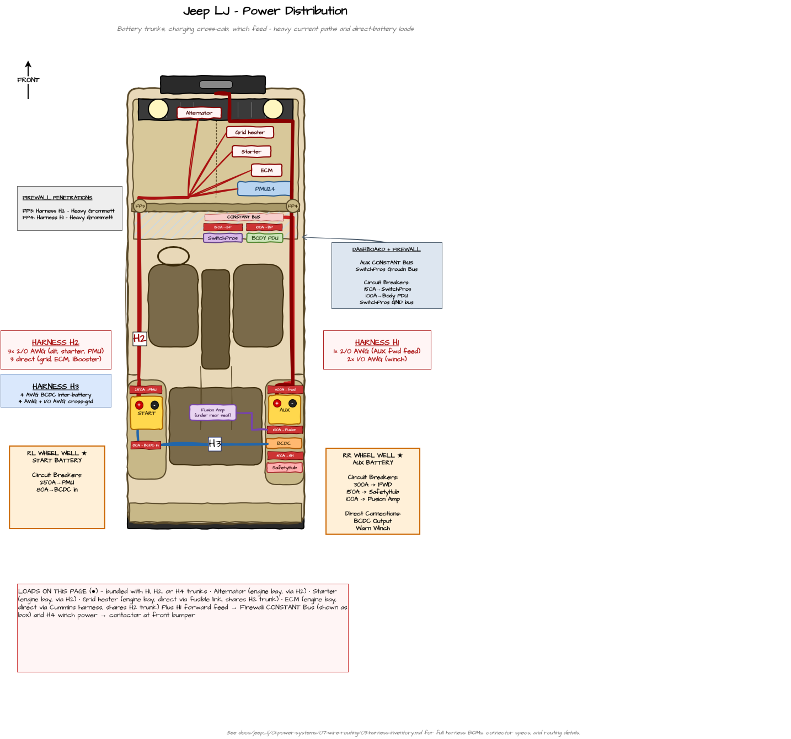

---
hide:
  - toc
tags:
  - wire-routing
  - harness
---

# 1.7.4 Power Distribution {#harness-power-distribution}

Workbench specs for the high-current power harnesses: **H1** Passenger Rear Power Trunk, **H2** START Engine Bay Trunk, and **H3** BCDC Cross-Cab. These move battery power between the rear wheel wells, the firewall, and the engine bay.

*Top-down tub map of the power-distribution harnesses. Diagram source: `Jeep LJ Tub Map.drawio` (page "Power Distribution"); the image is regenerated from the draw.io file on each export.*

**Reading this sheet:** Wire colors follow the [Wire Color Convention][color-convention] (power = red, ground = black). These are power runs — they get a **black braided expandable sleeve with a per-harness tracer** ([Protective Sleeve & Tracers][sleeve-convention]); heat sleeve and P-clamp standards by location are in [Wire Protection Standards][wire-routing]. For the system-wide picture and the bundle interference analysis, see the [Harness Inventory][harness-inventory] overview.

---

## H1 — Passenger Rear Power Trunk (AUX Forward Feed + Winch) {#h1}

*Formed 2026-05-30 by merging the prior H1 (AUX forward feed) and H4 (winch feed). The two shared the entire passenger-side path, so they are fabricated and installed as a single 3-cable bundle.*

**Build:** 3 conductors · longest run ~13 ft to firewall (+13 ft for the winch pair to the bumper) · ~1.5" OD black braided sleeve, red tracer · ring lugs both ends.

**Route:** Passenger rear wheel well (AUX battery) → up inside passenger rear quarter sill → forward along **inside floor board / side wall** (passenger side) → A-pillar area → **single sealed 2-piece grommet through firewall** (continuous cables, no firewall break) → engine bay → forward along passenger inner fender → through grille area → front bumper (winch portion only)

**Length:** ~13 ft to firewall (all 3 cables); ~13 ft additional for winch cables continuing to bumper

**Contains:**

| Wire | Gauge | Color | Function | Termination at battery | Termination at firewall | Continues to |
|:-----|:-----:|:-----:|:---------|:----------------------|:------------------------|:-------------|
| Forward feed (+) | 2/0 AWG | Red | Powers SwitchPros + BODY PDU via Firewall CONSTANT bus (Fusion head unit rides the BODY PDU via CB30) | Ring lug to 300A CB output stud | Continuous through grommet — no firewall break | Ring lug to Firewall CONSTANT bus input stud (cabin side) |
| Winch power (+) | 1/0 AWG | Red | AUX battery+ → winch contactor B+ | Ring lug to AUX battery+ stud | Continuous through grommet — no firewall break | Lug to winch contactor B+ |
| Winch ground (−) | 1/0 AWG | Black | AUX battery- → winch contactor B− | Ring lug to AUX battery- stud | Continuous through grommet — no firewall break | Lug to winch motor / chassis at front |

**Firewall pass-through:** **Single sealed 2-piece rubber grommet** sized for the ~1.5" OD bundle (~1.75" firewall hole). Cables run continuously from rear wheel well to their respective destinations — no service break at the firewall. The grommet seals the firewall penetration only; the cables themselves are uninterrupted.

**Why continuous cables + grommet (not inline connectors or bulkhead studs):**

- WARN install documentation references this approach as standard for winch firewall pass-through
- Common feed-through marine bulkhead studs (Blue Sea 2203/2204, Cole Hersee 46211) max at 250A continuous and were underrated for the winch leg (409A peak); continuous cable + grommet sidesteps any pass-through current limit — the cable is the conductor, the grommet only seals the hole
- Anderson SB175 is undersized for the winch leg (175A continuous); SBE320/SB350 would work but adds complexity
- Service is rare in practice — when needed, pulling the entire cable end-to-end is acceptable
- Steele Rubber or similar 2-piece grommet, ~$5–15

**Protection:** Black braided expandable sleeve (red tracer) over the entire cabin path, sized to the ~1.5" OD bundle. Heat sleeve over the sleeve where the winch cables enter engine bay. P-clamps every 12–18".

**Notes:**

- 3-cable bundle: ~1.5" OD final wrapped harness
- Path is fully inside the body until firewall transition (no exposed frame rail)
- Cables terminate as ring lugs at destinations (lug-to-stud at battery / CB / bus / contactor on each end). If a service break is ever desired, do it as a lug-to-lug junction inside the rear wheel well, not at the firewall.

---

## H2 — START Engine Bay Trunk {#h2}

*Gained a 4th conductor on 2026-06-07 when the radiator fan, iBooster, and TCU were relocated off the PMU onto the [START+ Forward Distribution Bus][start-fwd-bus]. Its 2 AWG master feed runs the same driver-side rear-well → engine-bay path as the existing three cables, so it is fabricated and installed as part of this bundle.*

**Build:** 4 conductors (3× 2/0 AWG + 1× 2 AWG) · 6–8 ft per cable · ~1.6" OD black braided sleeve, yellow tracer · lug terminations both ends · heat sleeve at engine-bay entry.

**Route:** Driver rear wheel well (START battery) → up inside driver rear quarter sill → forward along **inside floor board / side wall** (driver side) → A-pillar area → driver firewall penetration → engine bay

**Length:** 6–8 ft per cable

**Contains:**

| Wire | Gauge | Color | Function | Termination at battery | Termination at engine bay |
|:-----|:-----:|:-----:|:---------|:----------------------|:--------------------------|
| Alternator charging input | 2/0 AWG | Red | Alternator → START battery+ | Lug to battery+ stud | Lug to alternator output stud |
| Starter motor power | 2/0 AWG | Red | START battery+ → starter | Lug to battery+ stud | Lug to starter B+ stud |
| PMU24 main feed | 2/0 AWG | Red | START battery+ → 250A CB → PMU24 | Lug to 250A CB output | Lug to PMU power stud |
| START+ Forward Dist Bus master feed | 2 AWG | Red | START battery+ → 150A master CB → engine-bay busbar (fan / iBooster / TCU) | Lug to 150A CB output | Lug to [START+ Forward Distribution Bus][start-fwd-bus] busbar input stud |

(BCDC input feed (4 AWG via 80A CB) takes the H3 cross-cab path instead — see [H3](#h3).)

**Connectors:** Lug terminations at both ends. Heat sleeve required where bundle enters engine bay (>12" from exhaust). Bundle 4 cables with looms; expect ~1.6" OD final bundle. The 2 AWG forward-bus feed terminates at the engine-bay busbar, not at a load; the busbar's three short local feeds (fan, iBooster, TCU) are engine-bay-side and are **not** part of this harness — see [START+ Forward Distribution Bus][start-fwd-bus].

**Protection:** Black braided expandable sleeve (yellow tracer) over the cabin / sill run, sized to the ~1.6" OD bundle. Heat sleeve in engine bay. P-clamps every 12–18".

**Firewall penetration:** Driver-side grommet for high-current cables — separate from the HDP24 (HDP24 is passenger-side, signal-only). Four cables (3× 2/0 AWG + 1× 2 AWG) need a grommet sized for ~1.6" bundle OD.

**Notes:**

- All 4 high-current cables share the same driver-side floor / side wall path
- Path is fully inside the body (no exposed frame rail)
- Driver-side firewall grommet is a new firewall penetration — separate from existing passenger-side HDP24 and SwitchPros bulkheads
- The 2 AWG forward-bus master feed is the rear-to-front leg only; the engine-bay busbar fan-out to the radiator fan (4 AWG), iBooster (8 AWG), and TCU (12 AWG) lives on the engine-bay side — TCU's leg is harness [H9][controls-build]

---

## H3 — BCDC Cross-Cab {#h3}

**Build:** 2 conductors · ~5–6 ft straight run under the rear bench · lug terminations both ends · black braided sleeve, green tracer, no inline connectors.

**Route:** Driver rear wheel well (START battery) → **under the rear bench seat cushion** → passenger rear wheel well (BCDC + AUX battery)

**Length:** ~5–6 ft (straight cross-cab run under bench)

**Contains:**

| Wire | Gauge | Color | Function | Termination at driver well | Termination at passenger well |
|:-----|:-----:|:-----:|:---------|:--------------------------|:------------------------------|
| BCDC input | 4 AWG | Red | START battery+ via 80A CB → BCDC input terminal | Lug to 80A CB output | Lug to BCDC input red terminal (M8) |
| Cross-ground reference | 1/0 AWG | Black | START battery- → AUX battery- (critical for BCDC operation) | Lug to START battery- | Lug to AUX battery- |

**Connectors:** Lug terminations both ends. No inline connectors needed for short run.

**Protection:** Black braided expandable sleeve (green tracer) along the run. Bench cushion provides physical shielding from above; floor pan shields from below. P-clamps to body cross-member at 1–2 points.

**Notes:**

- Under-bench routing is short, dry, accessible, and physically protected (bench cushion above, floor pan below)
- No frame rail exposure; no need to share the longer floor / side wall paths used by H1 / H2
- BCDC sensor cable (~6 ft, 2-pin) is included with BCDC unit, runs to AUX battery+ terminal at the same wheel well — short, stays passenger-side, not part of this harness
- Path is independent of cabin trunk runs (H1 passenger side, H2 driver side), so no cabin trunk congestion impact

---

## Related Documentation

- [Harness Inventory][harness-inventory] - Overview, harness map, and bundle interference assessment
- [Lighting & SwitchPros Build Sheet][lighting-build] - H4, H5
- [Controls, Recovery & Drivetrain Build Sheet][controls-build] - H6–H9
- [Wire Routing][wire-routing] - Zone-based routing and protection standards
- [Firewall Ingress][firewall-ingress] - Firewall penetrations and bulkhead specs
- [AUX Battery Distribution][aux-battery] - H1 source
- [START Battery Distribution][start-battery] - H2 / H3 source
- [Recovery Systems / Winch][recovery] - H1 winch portion destination

[harness-inventory]: 03-harness-inventory.md
[color-convention]: 03-harness-inventory.md#wire-color-convention
[sleeve-convention]: 03-harness-inventory.md#sleeve-convention
[lighting-build]: 05-harness-lighting-switchpros.md
[controls-build]: 06-harness-controls-recovery-drivetrain.md
[wire-routing]: index.md
[firewall-ingress]: 02-firewall-ingress.md
[aux-battery]: ../03-aux-battery-distribution/index.md
[start-battery]: ../02-starter-battery-distribution/index.md
[start-fwd-bus]: ../02-starter-battery-distribution/index.md#start-forward-bus
[recovery]: ../../08-exterior-systems/01-winch.md
