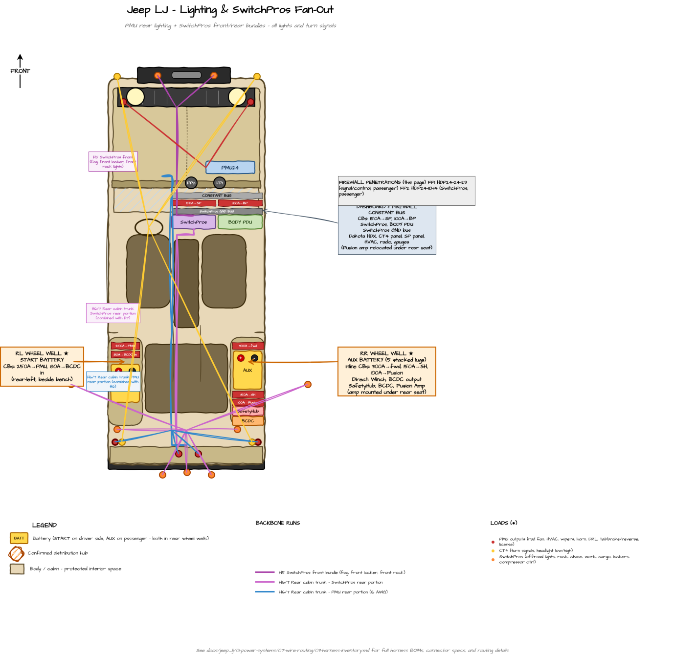

---
hide:
  - toc
tags:
  - wire-routing
  - harness
---

# 1.7.5 Build Sheet — Lighting & SwitchPros {#harness-lighting-switchpros}

Workbench specs for the SwitchPros lighting harnesses: **H4** SwitchPros Front Bundle (forward loads through the dedicated SP bulkhead) and **H5** Rear Cabin Trunk Bundle (SwitchPros rear outputs + PMU rear lighting through the cabin trunk to a rear breakout).

*Top-down tub map of the lighting harnesses. Diagram source: `Jeep LJ Tub Map.drawio` (page "Lighting & SwitchPros"); the image is regenerated from the draw.io file on each export.*

**Reading this sheet:** SwitchPros loads arrive on the controller's own 2-pin Delphi pigtails — match those supplied colors rather than re-coloring. PMU outputs and grounds follow the [Wire Color Convention][color-convention] (ground = black; signal = builder's choice). Protection standards by location are in [Wire Protection Standards][wire-routing]; system-wide context is in the [Harness Inventory][harness-inventory] overview.

---

## H4 — SwitchPros Front Bundle {#h4}

*Previously numbered H5. Renumbered 2026-05-31 when the catalog was compacted after the H1+H4 and H6+H7 merges.*

**Build:** 3 SwitchPros outputs (6 conductors) · 4–8 ft depending on destination · Delphi 2-pin at SP side, HDP24-18-14 at firewall · split loom forward.

**Route:** SwitchPros (firewall, cabin side) → **dedicated SwitchPros HDP24-18-14 firewall bulkhead** → engine bay → grille / front bumper / front axle

**Length:** 4–8 ft (depending on destination)

**Contains:**

| SwitchPros output | Gauge | Color | Function | Destination | SP bulkhead pins |
|:-----------------:|:-----:|:-----:|:---------|:------------|:----------------:|
| OUT-3 (35A circuit) | 14 AWG | Per SP pigtail | Fog light | Front bumper (BD S8 amber) | 1 (+) / 2 (−) |
| OUT-6 (front rocks subset, 15A circuit, shared with rear) | 14 AWG | Per SP pigtail | Front bumper rock light + 2x front wheel well rock lights | Splice at front for 3 lights | 3 (+) / 4 (−) |
| OUT-17 (low-side 2A) | 18 AWG | Per SP pigtail | Front ARB locker solenoid | Front axle (~12 ft from SP) | 5 (+) / 6 (−) |

**Connectors:** Custom 2-pin Delphi at SwitchPros output side (per SP harness convention); harness terminates at HDP24-18-14 cabin-side plug at firewall. Engine-bay side picks up at HDP24-18-14 receptacle and re-terminates as 2-pin Delphi at each light/solenoid.

**Ground strategy:** Each output's load ground returns through the SP bulkhead (pins 2, 4, 6) to the SwitchPros Ground Bus on cabin side. Clean SP-native architecture; no reliance on chassis ground at forward loads.

**Notes:**

- 3 forward-going SwitchPros circuits in this bundle, 6 pins through dedicated SP bulkhead (HDP24-18-14)
- Front locker wire (18 AWG) is the longest run — passes through front fender well and along front axle
- Front rock lights (4 in front wheel wells + 1 front bumper) all share OUT-6 with rear rocks
- Could be split into "front bumper sub-harness" (fog + front rock + front bumper) and "front axle sub-harness" (front locker) if those routings diverge
- **8 spare pins** on SP bulkhead accommodate future ditch/roof additions if A-pillar routing becomes impractical

See [SwitchPros Firewall Bulkhead][firewall-ingress] for connector spec and pinout.

---

## H5 — Rear Cabin Trunk Bundle (SwitchPros Rear + PMU Rear) {#h5}

*Formed 2026-05-30 by merging the prior H6 (SwitchPros rear outputs) and H7 (PMU rear lighting). The two shared the firewall-to-rear cabin trunk path, so they are fabricated as a single multi-conductor bundle with a rear cargo bulkhead breakout connector.*

**Build:** ~10 conductors (mostly 14 AWG) · 8–14 ft (PMU portion ~11–16 ft incl. engine-bay leg) · single multi-pin breakout at rear cargo bulkhead · split loom + wrapped sleeve through trans tunnel.

**Route:** SwitchPros (firewall, cabin side) + PMU24 outputs (via HDP24 pins 4/5/6 from engine bay) → converge at firewall → cabin trunk (trans tunnel) → rear cargo bulkhead breakout → fans out to rear destinations

**Length:** 8–14 ft (depending on destination; PMU portion is ~11–16 ft total including engine bay leg)

**Contains:**

| Source | Output / Function | Gauge | Color | Destination |
|:-------|:------------------|:-----:|:-----:|:------------|
| **SwitchPros** OUT-6 (shared with front) | Rear rocks (rear bumper + 2× rear wheel well) | 14 AWG | Per SP pigtail | Splice at rear for 3 lights |
| **SwitchPros** OUT-7 | Chase light (BD RTL-S 30") | 14 AWG | Per SP pigtail | Rear bumper |
| **SwitchPros** OUT-10 | Rear ARB locker solenoid | 14 AWG | Per SP pigtail | Rear axle |
| **SwitchPros** OUT-12 | Rear work lights (2× BD S1) | 14 AWG | Per SP pigtail | Above license plate |
| **SwitchPros** OUT-13 | Cargo lights (2× flush in rear wheel wells) | 14 AWG | Per SP pigtail | Triggered by rear cargo rocker |
| **SwitchPros** TRIGGER-2 | Cargo rocker switch return | 18 AWG | Per SP pigtail | Rear cargo rocker (rear wheel well top) |
| **PMU** OUT-21 | Brake signal | 16 AWG | Builder's choice | Tail clusters (L+R) + 3rd brake |
| **PMU** OUT-22 | Reverse signal | 16 AWG | Builder's choice | Tail clusters (L+R) |
| **PMU** OUT-23 | Running/parking signal | 16 AWG | Builder's choice | Tail clusters (L+R) + license plate |
| **PMU** ground return | Common tail cluster ground | 16 AWG | Black | SwitchPros GND bus at firewall |

**Connectors:**

- **Firewall (cabin side):** SwitchPros outputs originate as Delphi 2-pin pigtails at SP module; PMU outputs enter the cabin via HDP24 pins 4/5/6. Both join the trunk wrap aft of firewall.
- **Rear cargo bulkhead breakout:** Single multi-pin connector — **Deutsch DT15-XX (15-pin)** or **AMP CPC ~15-pin**. All ~10 conductors mate at this single service point.
- **Rear-side pigtails:** Short individual harnesses from breakout to each destination (chase, work, cargo, rocks, locker, tail clusters).

**Protection:** Split loom + wrapped harness sleeve through cabin trunk. P-clamps every 12–18".

**Notes:**

- ~10 conductors in the cabin trunk bundle (mostly 14 AWG + a few 16/18 AWG)
- **Service model:** R&R any rear light by swapping its pigtail at the rear bulkhead breakout. The cabin trunk pull stays in place.
- Splices needed for the tail clusters: each PMU output feeds both driver and passenger sides + 3rd brake/license — can be done at the breakout or with Y-splices closer to lights
- CT4 rear turn signals could also join this bundle through the cabin trunk; tracked separately because they originate at CT4 (steering column) not firewall

---

## Related Documentation

- [Harness Inventory][harness-inventory] - Overview, harness map, and bundle interference assessment
- [Power Distribution Build Sheet][power-build] - H1, H2, H3
- [Controls, Recovery & Drivetrain Build Sheet][controls-build] - H6–H9
- [Wire Routing][wire-routing] - Zone-based routing and protection standards
- [Firewall Ingress][firewall-ingress] - SwitchPros bulkhead (HDP24-18-14) pinout
- [SwitchPros SP-1200][switchpros] - H4 / H5 source controller
- [PMU24 Outputs][pmu-outputs] - H5 PMU source

[harness-inventory]: 03-harness-inventory.md
[color-convention]: 03-harness-inventory.md#wire-color-convention
[power-build]: 04-harness-power-distribution.md
[controls-build]: 06-harness-controls-recovery-drivetrain.md
[wire-routing]: index.md
[firewall-ingress]: 02-firewall-ingress.md
[switchpros]: ../../05-control-interfaces/02-switchpros-sp1200.md
[pmu-outputs]: ../04-pmu/03-pmu-outputs.md
