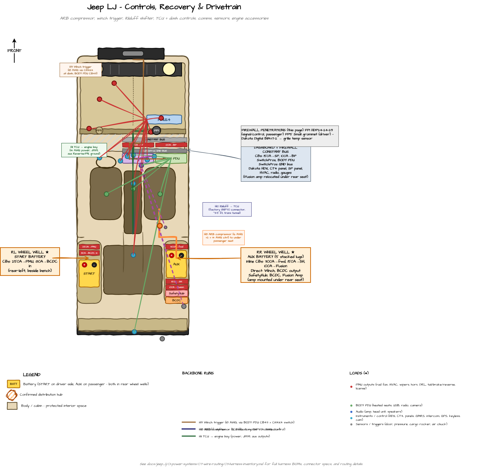

---
hide:
  - toc
tags:
  - wire-routing
  - harness
---

# 1.7.6 Build Sheet — Controls, Recovery & Drivetrain {#harness-controls-recovery-drivetrain}

Workbench specs for the recovery and drivetrain harnesses: **H6** ARB Compressor, **H7** Winch Trigger, **H8** Kilduff Shifter → TCU, and **H9** TCU → Engine Bay.

*Top-down tub map of the controls/recovery/drivetrain harnesses. Diagram source: `Jeep LJ Tub Map.drawio` (page "Controls, Recovery & Drivetrain"); the image is regenerated from the draw.io file on each export.*

**Reading this sheet:** Power = red, ground = black; CAN runs as a twisted pair; vendor-supplied harnesses (ARB, CH4X4, Kilduff/ZF) keep their shipped colors. See the [Wire Color Convention][color-convention]. Protection standards by location are in [Wire Protection Standards][wire-routing]; system-wide context is in the [Harness Inventory][harness-inventory] overview.

---

## H6 — ARB Compressor Bundle {#h6}

*Previously numbered H8. Renumbered 2026-05-31.*

**Build:** 4 conductors (2× 6 AWG motor + 2 signal) · ~10 ft · lug at SafetyHub, ring/spade at compressor · the two signal wires originate at SwitchPros, not SafetyHub.

**Route:** SafetyHub (passenger rear wheel well) → under cargo / under rear bench → under passenger seat (compressor mount)

**Length:** ~10 ft

**Contains:**

| Wire | Gauge | Color | Function | Termination at SafetyHub | Termination at compressor |
|:-----|:-----:|:-----:|:---------|:-------------------------|:--------------------------|
| Motor 1 power | 6 AWG | Red (per ARB) | SafetyHub MIDI-1 (60A) → compressor motor 1 | Lug to MIDI-1 output | Compressor motor terminal |
| Motor 2 power | 6 AWG | Red (per ARB) | SafetyHub MIDI-2 (60A) → compressor motor 2 | Lug to MIDI-2 output | Compressor motor terminal |
| Control signal | 14 AWG | Per SP pigtail | SwitchPros OUT-11 → compressor control terminal | (Comes from SwitchPros at firewall, not SafetyHub — runs separately or joins this bundle along common path) | Compressor control terminal |
| Pressure switch | 18 AWG | Per SP pigtail | ARB pressure switch (on manifold under passenger seat) → SwitchPros TRIGGER-3 | (At firewall, not SafetyHub) | Pressure switch normally-open contact |

**Connectors:** Lug at SafetyHub side, ring/spade at compressor. ARB compressor manifold typically has a pigtail with its own connector.

**Notes:**

- Motor 1 + motor 2 are 6 AWG (high current, brief peaks) — bundle as a pair
- Control + pressure switch wires originate at SwitchPros at firewall, NOT SafetyHub — they run from firewall through cabin to under passenger seat
- Could be merged into H6 if they share routing, or kept separate as "H6b ARB signal"

**Optimization opportunity:** Run the SwitchPros control + pressure switch wires through the cabin trunk to under passenger seat as part of [H5 SwitchPros rear bundle][lighting-build] (they're SP wires anyway), and split off at the compressor. Saves a separate harness — the only ARB-specific harness is the 2x 6 AWG motor cables from SafetyHub.

---

## H7 — Winch Trigger Control (small wire) {#h7}

*Previously numbered H9. Renumbered 2026-05-31.*

**Build:** 5 conductors (all 18 AWG) · ~3 ft (BODY PDU → dash) + ~13 ft (dash → contactor) · CH4X4 switch ships its own pigtail + cable kit · HDP24 at firewall.

**Route:** BODY PDU (firewall, cabin side) → dash switch ([CH4X4 dual-momentary push][ch4x4-winch]) → HDP24 firewall pins 16/17 → winch contactor at front bumper

**Length:** ~3 ft (BODY PDU → dash) + ~13 ft (dash → contactor via engine bay)

**Contains:**

| Wire | Gauge | Color | Function | Termination |
|:-----|:-----:|:-----:|:---------|:------------|
| Switch +12V supply | 18 AWG | Red | BODY PDU CB43 (10A) → CH4X4 switch common | Spade at BODY PDU, included pigtail at switch |
| IN trigger | 18 AWG | Per CH4X4 pigtail | CH4X4 IN button → HDP24 pin 16 → contactor IN trigger | Included pigtail at switch, HDP24 socket, ring/spade at contactor |
| OUT trigger | 18 AWG | Per CH4X4 pigtail | CH4X4 OUT button → HDP24 pin 17 → contactor OUT trigger | Included pigtail at switch, HDP24 socket, ring/spade at contactor |
| Illumination supply | 18 AWG | Per CH4X4 pigtail | Dash illumination circuit | Included pigtail at switch |
| Switch ground | 18 AWG | Black | Switch common ground | Chassis ground at dash |

**Connectors:** CH4X4 includes its own connector + cable kit. HDP24-24-29 at firewall penetration. Ring/spade terminals at contactor.

**Notes:**

- BODY PDU CB43 (10A, ~3 ft to dash) replaces the previously-planned SafetyHub ATC-1 (15A, ~13 ft from rear wheel well). The 18 AWG wire is properly sized for the ~3A trigger current; the prior 14 AWG / 15A spec was over-built and routed wastefully.
- Switch is dual-momentary push (not a polarity-reversing rocker) — the WARN ZEON 10-S contactor handles polarity internally
- Warn handheld remote wires in parallel at the contactor trigger terminals
- SafetyHub ATC-1 slot freed for future use (recovery accessories etc.)

---

## H8 — Kilduff Shifter to TCU {#h8}

*Previously numbered H10. Renumbered 2026-05-31.*

**Build:** 1 multi-conductor proprietary harness (supplied with the Kilduff shifter kit) · ~3–5 ft · factory 8HP70 connectors · no fabrication required.

**Route:** Kilduff shifter in **center console** → straight down through trans tunnel → Turbolamik TCU **mounted on 8HP70 mechatronic** (transmission valve body)

**Length:** ~3–5 ft

**Contains:**

| Wire | Gauge | Color | Function | Termination at shifter | Termination at TCU |
|:-----|:-----:|:-----:|:---------|:----------------------|:-------------------|
| Shifter harness | Proprietary multi-conductor (factory 8HP70 connector) | Factory (Kilduff/ZF) | All shifter signals (P/R/N/D, manual +/−, button states, illumination) | Kilduff-supplied connector at shifter base | Factory 8HP70 connector at TCU |

**Connectors:**

- Kilduff supplies the shifter end of the harness with their shifter kit
- TCU end uses the factory 8HP70 mechatronic connector (Turbolamik TCU 2.0 mates to this)

**Protection:** Split loom through trans tunnel. The trans tunnel keeps the cable away from cabin contents and provides a clean straight run.

**Notes:**

- TCU is **mounted on the 8HP70 mechatronic** (the trans valve body), not in cabin or engine bay — so this is a very short pull
- No firewall penetration
- No other H-series harnesses share this path — it's a single-purpose, self-contained run
- Kilduff includes the wiring harness with the shifter kit — no separate fabrication required

See [Transmission][transmission] for shifter and TCU specs.

---

## H9 — TCU to Engine Bay {#h9}

*Previously numbered H11. Renumbered 2026-05-31.*

**Build:** 6 conductors (incl. one twisted CAN pair) · 3–4 ft · TCU connector at one end, individual terminations in engine bay · split loom + heat sleeve at engine-bay entry.

**Route:** Turbolamik TCU on 8HP70 mechatronic → up through trans tunnel forward → engine bay (PMU + J1939 tap + starter P/N relay)

**Length:** 3–4 ft

**Contains:**

| Wire | Gauge | Color | Function | Source | Destination |
|:-----|:-----:|:-----:|:---------|:-------|:------------|
| TCU power feed | 14 AWG | Red | PMU OUT16 (CONSTANT, 15A) → TCU power input | PMU OUT16 (engine bay) | TCU power terminal |
| J1939 CAN High | Twisted pair | Twisted pair (CAN) | Shared J1939 bus tap (same tap as PMU, Dakota Digital BIM-01-2) | CAN bus tap point | TCU CAN-H |
| J1939 CAN Low | Twisted pair (paired with CAN High) | Twisted pair (CAN) | Shared J1939 bus tap | CAN bus tap point | TCU CAN-L |
| Aux out (Reverse) | 18 AWG | Builder's choice | TCU aux output: 12V when shifter in R → PMU In 3 (drives PMU OUT22 reverse lights) | TCU aux Reverse pin | PMU In 3 |
| Aux out (P/N) | 18 AWG | Builder's choice | TCU aux output: 12V when shifter in P or N → starter P/N interlock relay coil | TCU aux P/N pin | Starter P/N interlock relay coil+ |
| TCU ground | 14 AWG | Black | TCU ground return | TCU ground terminal | Engine bay ground bus |

**Connectors:**

- TCU end: Turbolamik TCU's connector (depends on TCU model — 2.0 typically uses a small Deutsch DT or similar)
- Engine bay ends: Each wire terminates at its destination (PMU spade/screw terminal, J1939 splice, relay coil terminal, ground bus stud)

**Protection:** Split loom from TCU through trans tunnel up to engine bay. Heat sleeve where it enters engine bay zone (>12" from exhaust).

**Notes:**

- All endpoints are in engine bay — no firewall penetration needed
- J1939 CAN tap is shared with PMU and Dakota Digital BIM-01-2 — the TCU is a third node on the same bus (just adds a splice at the existing tap point)
- The brake switch input to TCU (for unlock-from-Park) is sourced from the cabin brake pedal switch (which already feeds PMU In 2 via HDP24 pin 13) — could share routing or take a separate tap; routing TBD
- TCU is one of three controllers tightly coupled to the engine bay: PMU24 (mounted on firewall), Dakota Digital BIM modules (on HDPE panel cabin side), and TCU (mounted on transmission). All share the J1939 CAN bus.

See [Transmission][transmission] and [PMU Outputs][pmu-outputs] for related details.

---

## Related Documentation

- [Harness Inventory][harness-inventory] - Overview, harness map, and bundle interference assessment
- [Power Distribution Build Sheet][power-build] - H1, H2, H3
- [Lighting & SwitchPros Build Sheet][lighting-build] - H4, H5
- [Wire Routing][wire-routing] - Zone-based routing and protection standards
- [Firewall Ingress][firewall-ingress] - HDP24 pinout (H7 trigger pins 16/17)
- [SafetyHub 150][safetyhub] - H6 source
- [SwitchPros SP-1200][switchpros] - H6 control source
- [Transmission][transmission] - H8 shifter and H9 TCU specs
- [PMU24 Outputs][pmu-outputs] - H9 source
- [Air Compressor][air-compressor] - H6 destination

[harness-inventory]: 03-harness-inventory.md
[color-convention]: 03-harness-inventory.md#wire-color-convention
[power-build]: 04-harness-power-distribution.md
[lighting-build]: 05-harness-lighting-switchpros.md
[wire-routing]: index.md
[firewall-ingress]: 02-firewall-ingress.md
[safetyhub]: ../03-aux-battery-distribution/04-safetyhub.md
[switchpros]: ../../05-control-interfaces/02-switchpros-sp1200.md
[transmission]: ../../10-drivetrain/01-transmission.md
[pmu-outputs]: ../04-pmu/03-pmu-outputs.md
[air-compressor]: ../../08-exterior-systems/02-air-compressor.md
[ch4x4-winch]: https://ch4x4.com/product/ch4x4-momentary-dual-push-switch-for-toyota-winch-in-out-symbol/
