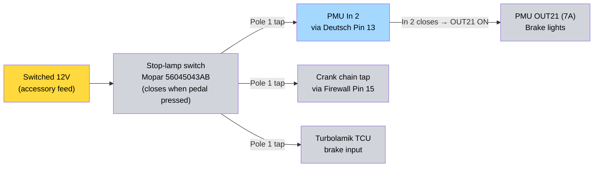

---
hide:
  - toc
tags:
  - product-details
  - engine-systems
  - brake-system
  - ibooster
---

# 2.2 Brake Booster - Bosch iBooster Gen 2 + Wilwood MC {#brake-booster-system-bosch-ibooster-gen-2}

/// html | div.product-info
{ loading=lazy }

**Type:** Electric vacuum-independent brake booster + Wilwood tandem master

**iBooster:** Bosch iBooster Gen 2

**iBooster Donor:** Honda Accord Hybrid — Bosch iBooster **Gen 2**[^donor-year]

**Honda OEM Part Numbers:** `46680-T3Z-A00` (booster module), `01469-TWA-A58` (MC/reservoir kit); MC mfr # `46100-TWA-A550-M1`[^donor-year]

[^donor-year]: Part numbers **confirmed against the secured donor** — eBay listing #397546491129 (offer accepted 2026-05-30), OE/OEM: `46680-T3Z-A00` + `01469-TWA-A58`, MC mfr # `46100-TWA-A550-M1`, brand Honda, made in Japan. This is the first-party reference of record; the booster is the Bosch **Gen 2** unit (EVcreate lists the Honda Accord under Gen 2; Back Bay Customs adapter is Honda-Accord-iBooster-only, vendor 2026-05-30). **Model year is intentionally not asserted:** the listing states no year and the `T3Z` booster code does not map cleanly to a single Accord Hybrid generation in public catalogs — and it no longer matters, since the physical part (not a year-based catalog lookup) is now the fitment reference. The seller's own note ("eBay compatibility chart is not always correct… contact local dealer with your VIN") reinforces not relying on a catalog year. Supersedes the earlier "2017-2022 / 2018-2022" estimates. Verified 2026-05-30.

**Master Cylinder:** Wilwood 260-15542 Tandem Compact — **1.00" bore** (sized to TJ Rubicon front calipers; see Master Cylinder section)

**MC Adapter:** [Back Bay Customs Wilwood iBooster Adapter][backbay-adapter] — Honda Accord iBooster only (not Tesla); confirmed compatible with Wilwood 260-15542 (vendor, 2026-05-30)

**Reservoirs:** 2× Wilwood 260-16392 (4 oz anodized, remote) — vendor-confirmed OK with adapter[^mc-reservoir]

[^mc-reservoir]: Wilwood 260-16392 confirmed: **4.0 oz** capacity, **9/16-18 × -3 AN** hose connector (the -3 AN feed matches the Plumbing section). Source: [Summit Racing](https://www.summitracing.com/parts/wil-260-16392) / JEGS (checked 2026-05-30; thread figure is retailer-sourced).

**Mounting:** Direct firewall mount via booster's integral 4-stud flange (60×80mm M8, **80mm oriented vertical**) + SendCutSend cabin-side backing plate

**Power Source:** PMU OUT1+10 (40A main), OUT19 (5A ignition signal)

**Wiring Harness:** TBD - [Tulay's Gen 2][tulays-harness] vs [EVcreate Gen 2 kit][evcreate-donors]

///

## Overview

Electromechanical brake booster required for the Cummins R2.8 diesel (minimal manifold vacuum). The Honda Accord Hybrid donor delivers the same Bosch Gen 2 unit as the Tesla Model 3 with better DIY documentation and sourcing. The Honda variant also ships with a factory **remote-mounted** reservoir (Honda solved the angled-reservoir issue at the OEM level) — moot for this build since the MC + reservoir are discarded in favor of the Wilwood ecosystem, but useful context.

The factory Tesla/Honda master cylinder is discarded. The Back Bay Customs adapter mates a Wilwood Tandem Compact master directly to the iBooster, eliminating the angled-reservoir problem on a vertical firewall and putting the brake hydraulics on Wilwood's remote-reservoir ecosystem. (MC bore is pending recalculation — see the Master Cylinder section.)

**Vendor compatibility (Back Bay Customs / Adam, email 2026-05-30):**

- Wilwood 260-15542 Tandem Compact **is compatible** with the adapter. (Note: 260-15542 is the **1.00"** bore unit; the MC bore is now pending recalculation — see the Master Cylinder section.)
- The adapter is designed for the **Honda Accord iBooster only**, *not* the Tesla variant. This build uses the Honda Accord Hybrid donor, so it matches.
- The 2× remote Wilwood reservoirs are fine with the adapter.
- The booster's 60×80mm firewall pattern[^bbc-firewall] must be mounted with the **80mm dimension vertical**. Back Bay offers a separate adapter for an 80mm-horizontal orientation, but it is **out of stock** as of this writing — design around the 80mm-vertical orientation.

## Specifications

### iBooster

- **Current:** 40A peak (braking), 0.25A idle, 12mA standby
- **Mounting Bolt Torque:** 13 Nm (115 in-lb) - 2× nyloc nuts, 13mm (M8)[^ibooster-torque]

### Master Cylinder

!!! success "✅ Bore resolved — 1.00\" (Wilwood 260-15542)"
    Hold lifted (2026-05-30). With the brake hardware now known — **TJ Rubicon front calipers** (2.595" single piston) and **rear disc**, targeting a **standard/light pedal feel** — the hydraulics size to a **1.00" bore**, which is Wilwood **260-15542**.[^mc-bore] Three independent drivers agree: (1) the factory TJ master cylinder is a 1.00" bore that Mopar engineered specifically around these front calipers; (2) a smaller bore gives lighter pedal effort (a 1.125" bore would make it heavier — the wrong direction for the requested feel); (3) 1.00" = 260-15542, **the exact part Back Bay confirmed the adapter against** — no re-confirmation needed. The 1.125" (260-15541) only wins for high-volume multi-piston big-brake calipers, which this build does not use. **OK to order the 260-15542.**

- **Bore:** **1.00" — Wilwood 260-15542** (factory-matched to TJ Rubicon front calipers)[^mc-bore]
- **Stroke:** 1.100" (260-15542)[^mc-stroke]
- **Outlets:** Tandem (independent front/rear circuits); outlet thread **1/2-20 IF** (confirmed)[^mc-ports]
- **Reservoir/Inlet Ports:** 2× (one per circuit, remote feed) — thread TBD with final bore selection[^mc-ports]

[^ibooster-torque]: Honda does not publish a Gen 2 iBooster-specific firewall-mount torque, but the booster mounts on **M8** studs (confirmed M8 by [EVcreate's iBooster install guide](https://www.evcreate.com/installing-the-ibooster/)), and Honda's published **power-brake-booster mounting-nut** torque is consistently **~115 in-lb / 13 Nm** across Accord generations (e.g. 115 in-lb on 2003-2007, 110 in-lb on 6th-gen). Corrected from the earlier unsourced 16.5 Nm estimate to the sourced **13 Nm** — also the conservative direction into the firewall + cabin-side backing plate. Do **not** confuse with the Bosch **16 Nm M12×1 brake-line** nut spec (a different fastener). Sources: [TorqueSpec Database — Accord 2003-2007](https://torque-spec-database.com/honda-accord-2003-2007/) (Power Brake Booster Mounting Nuts 115 in-lb); EVcreate (M8 confirmation). Verified 2026-05-30.
[^mc-bore]: **Bore sizing (2026-05-30).** Wilwood [260-15542-BK](https://www.wilwood.com/MasterCylinders/MasterCylinderProd?itemno=260-15542-BK) = **1.00" bore**; the 1.125" Tandem Compact is **260-15541** (different part). Selected 1.00" from the brake hardware: **front = TJ Rubicon calipers**, 2.595" single piston ≈ 5.29 sq in each, ~10.6 sq in front total; **rear = disc** (build runs front + rear disc); target **standard/light pedal effort**. Rationale: (1) the factory TJ master cylinder is itself a 1.00" bore that Mopar matched to these front calipers ([TJ community](https://www.jeepforum.com/threads/tj-brake-master-cylinder-upgrade.340389/): the 1" bore is "designed to work with booster force into a piston size of 5.22 sq in per side"); (2) at 1.00" bore × 1.10" stroke (0.86 cu in/circuit), worst-case caliper fill leaves ~50% stroke headroom even with rear discs; (3) smaller bore → higher line pressure per unit pedal force → lighter effort, matching the requested feel (1.125" would raise effort/shorten travel — only warranted for high-volume multi-piston big-brake calipers, not used here). 1.125"/260-15541 would also require re-confirming adapter fitment with Back Bay; 1.00"/260-15542 is the part they already confirmed. Pedal ratio (TJ auto pedal) should still be bench-measured on assembly as a **geometry/travel check** (confirm MC stroke headroom + iBooster input-rod travel), but it does not affect the bore — all three drivers favor 1.00" independently. Pedal *feel* itself is a drive-and-decide outcome with the parts now ordered, not a bench-tuned one. Supersedes the earlier "260-15542 = 1-1/8\"" error.
[^mc-stroke]: Wilwood 260-15542 official page lists **stroke 1.10"** — matches (checked 2026-05-30).
[^mc-ports]: **Outlets confirmed 1/2-20 IF** per Wilwood's [260-15542-BK page](https://www.wilwood.com/MasterCylinders/MasterCylinderProd?itemno=260-15542-BK) (fitting options: outlet 1 = 3/8-24 IF or 1/2-20 IF; outlet 2 = 3/8-24 IF or 9/16-18 IF). This corrects the earlier "11/16-20" outlet claim, which conflated the **flexline adapter** thread (the 220-12993 inlet adapter is 11/16-20) with the MC's native outlet. With the bore now fixed at **260-15542**, confirm the **inlet/reservoir** thread against the Wilwood datasheet for that part before ordering reservoir feed fittings (Wilwood's product page lists an inlet size but not a clean thread spec). Outlet verified 2026-05-30.

### Brake Hardware (downstream — MC bore design inputs)

- **Front calipers:** Jeep TJ Rubicon — single-piston floating, **2.595" piston** (~5.29 sq in each; ~10.6 sq in front total)[^brake-hw]
- **Rear:** disc — factory TJ rear disc, **PowerStop drilled & slotted rotors**[^brake-hw]
- **Pedal:** 03-06 TJ/LJ auto pedal (ratio bench-measured on assembly)
- These set the MC bore selection — see the Master Cylinder section and [^mc-bore].

[^brake-hw]: Front caliper piston Ø **2.595"** is the TJ Wrangler/Rubicon front spec ([replacement-parts data](https://www.wranglerforum.com/threads/brake-piston-dimensions.761722/), checked 2026-05-30). Rear is disc (build runs front + rear disc). The front calipers are the dominant input to the MC bore calc ([^mc-bore]); the rear disc volume is within the 1.00" bore's stroke headroom. Rear-disc setup **confirmed** (seller, 2026-05-31): factory TJ rear disc with PowerStop drilled & slotted rotors — this validates the rear-disc assumption the bore was sized against. The drilled/slotted rotors are a friction-surface upgrade and do not change caliper piston area, so the MC bore basis is unchanged; still confirm actual rear caliper piston area when finalizing fittings.

### Plumbing

**Reservoir → MC feed (low pressure):** -3 AN PTFE braided — Wilwood 220-12993 (see Master Cylinder section). Gravity feed only; not a pressure circuit.

**MC → calipers (high pressure) — hybrid hardline + axle flex.** Baseline design; switchable to a more standard (or full-PTFE) approach later without changing the MC or its 1/2-20 IF outlets.

- **Chassis runs:** 3/16" **copper-nickel** (NiCopp / Cunifer) hardline off the MC's 1/2-20 IF outlets, 45° double (bubble) flare with inverted-flare fittings. DOT-approved for hydraulic brakes, will not corrode, and hand-bends/flares without a hydraulic bender.[^brakeline-material] Copper-nickel is softer than steel, so sleeve in stainless spring "gravel guard" armor at exposed points and route inside the frame rail where possible.[^brakeline-armor]
- **Axle ends:** DOT-compliant (FMVSS 106) braided-stainless flex hose at each axle, extended length sized to full suspension droop. **Lengths are blocked on axle + suspension selection** (Section 10 TBDs) — do not cut to length until ride height/articulation is fixed.[^fmvss106]
- **Hardline → flex transition:** bulkhead fittings at each axle.
- **Proportioning:** the iBooster has no integral proportioning valve. Front disc + rear disc warrants an **adjustable proportioning valve** on the rear circuit (plus residual-pressure valves if needed); size on assembly. TBD.

**Alternative considered — full -3 AN PTFE braided throughout (MC to calipers):** common on non-street comp rigs and field-repairable with reusable ends + unions, but not chosen as the baseline for a street-registered LJ on two counts: (1) FMVSS 106 certification attaches to the finished hose *assembly*, so DIY bulk-hose builds with reusable ends are not certified for road use — DOT-legal use means pre-made certified (crimped) assemblies, which removes the trail-repair advantage;[^fmvss106] (2) the braid hides the PTFE liner, so internal abrasion/degradation can't be visually inspected, and the bare braid abrades adjacent components. The hybrid keeps inspectable hardline for the long runs and isolates flex (and its failure points) to the axles.

[^brakeline-material]: Copper-nickel (NiCopp / Cunifer / cupronickel) brake tubing is DOT-approved for hydraulic brake systems and has been in OE use since the 1970s (Volvo, Audi, Porsche). Strength comparable to steel, far better corrosion resistance, and bends ~58% easier than steel. Off-road trade-off: softer than steel, so less puncture-resistant — mitigate with spring armor. Sources: [AGS NiCopp](https://www.agscompany.com/products/domestic-nicopp-nickel-copper-brake-line), [BrakeConnect Cunifer](https://www.brakeconnect.com/cunifer-brake-line). Checked 2026-06-01.
[^brakeline-armor]: Stainless spring "gravel guard" / brake-line armor slips over 3/16" hardline (install before flaring) to deflect rock and debris strikes; route lines inside the frame rail since underbody lines are the most exposed to rock hazard. Sources: [4LifetimeLines gravel guard](https://4lifetimelines.com/products/ltgg316-8), [Eastwood brakeline armor](https://www.eastwood.com/3-16-stainless-steel-brakeline-armor-3ft.html). Checked 2026-06-01.
[^fmvss106]: FMVSS 106 (49 CFR 571.106) governs brake hose assemblies — it is a performance standard, not a material spec, so PTFE/braided-stainless hose can be DOT-compliant. Hydraulic brake hose must withstand 4,000 psi for 2 minutes without rupture; hose ≤1/8" inside diameter (e.g. -3 AN) is tested to 7,000 psi. Certification attaches to the completed assembly, and hose marketed "off-road use only" carries no DOT rating and is not for public-road use. Sources: [eCFR 49 CFR 571.106](https://www.ecfr.gov/current/title-49/subtitle-B/chapter-V/part-571/subpart-B/section-571.106), [Intertek FMVSS 106](https://www.intertek.com/automotive/standards/fmvss-106/). Checked 2026-06-01.

## Parts List

| Item | Part # | Source | Status | Notes |
| :--- | :----- | :----- | :----- | :---- |
| iBooster + MC pull | Honda 46680-T3Z-A00 (+ 01469-TWA-A58) | eBay (listing #397546491129) | ✅ Purchased ($195, offer accepted 2026-05-30) | Honda Accord Hybrid Gen 2 donor; part #s confirmed on listing |
| Auto brake pedal assembly | 03-06 TJ/LJ auto pedal | eBay / junkyard | **Ordered** | Wider pedal pad than manual; stop-lamp switch + connector included on donor |
| MC adapter | Back Bay Customs | [backbaycustoms.com][backbay] | ✅ Confirmed vs 260-15542 (vendor, 2026-05-30) — matches selected bore; ready to order | Steel plate + pushrod spacer + nyloc nuts; Honda iBooster only |
| Master cylinder | Wilwood 260-15542 (1.00") | Summit / Jegs | ✅ Bore resolved — ready to order | Tandem Compact, 1.00" bore, black E-coat |
| Reservoir (×2) | Wilwood 260-16392 | Summit / Jegs | Ready to order (vendor-confirmed OK) | 4 oz anodized, includes -3 AN fitting |
| Dual reservoir bracket | Wilwood 250-16393 | Summit / Jegs | Ready to order | Anodized billet, mounting screws incl. |
| Flexline (×2) | Wilwood 220-12993 | Summit / Jegs | Ready to order | 8" -3 AN, includes 11/16-20 adapter |
| Firewall mount (engine side) | iBooster integral 4-stud flange | Included w/ iBooster | Ships with donor | Bolts directly to firewall — 60×80mm M8 pattern (80mm vertical), ~62mm body neck through firewall[^body-neck] |
| Firewall reinforcement (cabin side) | SendCutSend custom — see [DXF][backing-plate-dxf] | ~$15-30 | ⚠️ DXF needs redesign for 60×80mm pattern (currently drawn 72×72mm — see Outstanding Items) | 3/16" A36 steel, 152×152mm, 12mm corner radius, 9mm M8 holes, 64mm center bore. Zinc yellow plating |
| Wiring harness | TBD | Tulay's or EVcreate | Decision pending donor arrival | Choice depends on donor pigtail condition |
| Brake hardline (caliper side) | 3/16" copper-nickel (NiCopp / Cunifer) coil | Summit / AGS / O'Reilly | Spec'd — order with fittings | DOT-approved; 45° double flare, 1/2-20 IF at MC; route inside frame rail |
| Hardline armor | 3/16" stainless spring gravel guard | 4LifetimeLines / Eastwood | Spec'd | Slide on before flaring; exposed runs |
| Inverted-flare fittings + bulkhead tees | 3/16" / -3 AN | Summit / Earl's / Wilwood | Spec'd | Hardline unions + hardline→flex transition at axles |
| Axle flex hoses | DOT braided stainless, extended length (TBD) | Goodridge / Rock Krawler / Synergy / Rusty's | ⚠️ Length blocked on axle + suspension TBD (Section 10) | FMVSS 106; size to full droop |
| Adjustable proportioning valve | TBD (Wilwood adjustable prop valve or equiv.) | Wilwood / Summit | TBD | Rear circuit — iBooster has no integral proportioning |

## Wiring

| Circuit                | Wire Gauge | Source          | Destination             | Notes                          |
| :--------------------- | :--------- | :-------------- | :---------------------- | :----------------------------- |
| Main Power (PMU side)  | 12 AWG × 2 | PMU OUT1, OUT10 | Splice near PMU         | PMU 2.8mm terminals max 12 AWG |
| Main Power (load side) | 10 AWG     | Splice          | iBooster main connector | CONSTANT (safety requirement)  |
| Ignition Signal        | 20 AWG     | PMU OUT19       | iBooster ignition input | SWITCHED (ignition RUN)        |
| Ground                 | 10 AWG     | iBooster ground | Engine Bay Bus Stud 7   | Same stud as main power ground |

**Wire Transition:** PMU terminals accept max 12 AWG. Two 12 AWG wires from OUT1 and OUT10 splice into a single 10 AWG wire **near the PMU** to minimize voltage drop.

See [PMU Outputs][pmu-outputs] for complete PMU configuration and thermal analysis.

## Firewall Backing Plate

3/16" A36 steel sandwich plate that sits on the cabin side of the firewall, opposite the iBooster's integral 4-stud flange. Spreads cantilevered load across a larger area of firewall sheet metal to prevent fatigue cracking at the new M8 holes.

**Geometry:**

- 152mm × 152mm (6"×6") square, 12mm corner radius
- 4× 9mm M8 clearance holes on a **60mm (horizontal) × 80mm (vertical)** rectangular pattern (80mm dimension vertical, per vendor)
- 64mm center pass-through bore (clearance for iBooster body neck protrusion)
- 3/16" (4.76mm) thickness
- Material: A36 mild steel
- Finish: zinc yellow plating (corrosion resistance for the cabin-side mounting area; also lets the plate stay visible-looking-intentional behind the dash)

!!! warning "DXF redesign required"
    The committed `lj-ibooster-backing-plate.dxf` was drawn for a **72×72mm square** hole pattern (holes at ±36mm). Back Bay Customs confirmed (2026-05-30) the iBooster firewall pattern is actually **60×80mm rectangular** (holes at ±30mm horizontal, ±40mm vertical), mounted 80mm-vertical. The DXF must be re-cut to the new pattern before ordering steel. The 152×152mm plate still provides ample edge margin (≥36mm at the ±40mm holes). Confirm the real hole spacing against the donor unit's studs during PLA test-fit before committing to steel.

**CAD file:** [`lj-ibooster-backing-plate.dxf`][backing-plate-dxf] (Fusion 360 — **needs update to 60×80mm pattern**)

**Fabrication workflow:**

1. 3D-print a 1:1 PLA prototype first for trial fit against the LJ firewall + iBooster assembly. Use this to confirm hole spacing matches the donor unit's actual studs and that the 64mm bore clears the booster body neck.
2. Verify clearance for cabin-side hardware (pedal box, HVAC blower, dash brackets) before committing to steel.
3. If PLA mockup fits, upload the DXF to SendCutSend and order in 3/16" A36 steel with zinc yellow plating finish.

## Brake Pedal Assembly

The factory LJ manual-trans pedal must be replaced with the 03-06 TJ/LJ **automatic** brake pedal to remove the clutch pedal and provide the correct pedal arm shape for an iBooster pushrod connection.

**Signal/wiring impact:** None new — the stop-lamp switch (Mopar 56045043AB) is identical on manual and auto brackets. The pedal swap inherits the existing brake-signal wiring already designed across three systems:

- **PMU is sensor + brain, not load path:** PMU In 2 senses pedal-pressed; PMU OUT21 (7A) carries the actual brake-light current. Switch itself only handles logic-level (<1A).
- **Single pole used:** TJ/LJ 03-06 stop-lamp switches are 2-pole (4 pins). Pole 1 routes to PMU/starter/TCU; Pole 2 was the factory cruise-deactivation pole — leave disconnected, not in this design.
- **Splice location:** Pole 1 output splices in the cabin into three branches — one to each downstream consumer.

See [tail/brake][tail-brake] (PMU lighting flow), [starter][starter] (crank chain), and [transmission][transmission] (TCU brake input) for the downstream details.

**Mechanical impact:**

- **Pushrod interface:** Same on both pedal styles - iBooster clevis attaches at factory pushrod hole. Pivot-to-pushrod distance is identical; pedal arm shape differs (straight on auto vs. offset on manual) but does not affect the pedal ratio. Bench-measure before final assembly to confirm.
- **BTSI provision:** Auto pedal has a second boss for the factory floor-shifter BTSI solenoid - leave empty; Kilduff/Turbolamik handles unlock-from-Park electronically.
- **Clutch removal:** Clutch pedal, clutch master cylinder, and CMC firewall pass-through are no longer used. Plug the ~1.25" CMC hole in the firewall with a block-off plate or weld closed.
- **Pedal pad:** Auto pedal pad is wider - cosmetic only.

**Donor checks:**

- Stop-lamp switch + retaining clip present (or buy new Mopar 56045043AB)
- Pushrod hole bushing in good shape
- Pedal arm not bent/cracked at pivot

## Installation Notes

- **Firewall mounting strategy:** Factory LJ vacuum booster holes are abandoned. The Honda Gen 2 iBooster bolts directly to the firewall via its own integral 4-stud flange (60×80mm M8 pattern, **80mm dimension vertical** per Back Bay Customs; 62mm body neck through the firewall) — no separate steel bracket. Drill matching holes in the LJ firewall, then sandwich a SendCutSend 3/16" steel backing plate on the cabin side to distribute the cantilevered load and prevent fatigue cracking at the new holes. If an 80mm-horizontal orientation is ever required, Back Bay sells a re-orientation adapter (currently out of stock).
- **Fallback paths:** If integral flange has engine-bay packaging conflicts, fall back to (a) SendCutSend custom one-off firewall plate that re-patterns mounting holes, or (b) Back Bay Customs one-off commission — *only worthwhile if they have access to an LJ for trial fit; without one, customer-measurement-blind design carries the same risk as SendCutSend at higher cost.*
- **Reservoir height:** Mount reservoirs 4-6" above MC flange on firewall standoff for proper gravity feed. More than 6" risks hood clearance issues.
- **Bench test before fab:** Apply 12V ignition signal to the iBooster and verify motor cycles + pedal rod assists. Used iBoosters fail frequently.
- **Cantilever support:** Gen 2 is lighter than Gen 1 but on a vertical firewall through-hole the cantilevered load + Jeep vibration warrants a secondary front support point (inner fender or frame brace).
- **Pushrod length (MC side):** Back Bay's adapter pre-sets MC pushrod length - no adjustment required.
- **Pushrod length (pedal side):** Re-measure after auto-pedal swap; adjust per iBooster install kit instructions (Tulay's or EVcreate) before bleeding.

## Installation Resources

- [Wiring the iBooster - EVcreate][evcreate-wiring]
- [Installing the iBooster - EVcreate][evcreate-install]
- [iBooster Donor Vehicles - EVcreate][evcreate-donors]
- [Back Bay Customs Shop][backbay]

## Outstanding Items

**Waiting on external action:**

- [x] ~~Confirm Back Bay Customs MC adapter compatibility with Wilwood 260-15542~~ — ✅ confirmed by vendor (Adam, 2026-05-30): adapter fits the 260-15542, is Honda-iBooster-only (not Tesla), and the remote reservoirs are fine. Blocker cleared.
- [x] ~~Close iBooster eBay offer ($195 sent on $254 listing)~~ — ✅ offer accepted 2026-05-30 (listing #397546491129); part #s 46680-T3Z-A00 + 01469-TWA-A58 confirmed on listing

**MC bore — resolved:**

- [x] ~~Recalculate the required MC bore from the brake-system hydraulics~~ — ✅ **1.00" → Wilwood 260-15542** (2026-05-30). Sized to TJ Rubicon front calipers + rear disc + standard/light pedal feel; factory-matched and agrees with the already-confirmed adapter fitment. See Master Cylinder section.
- [ ] Bench-measure TJ auto-pedal ratio on assembly — **geometry/travel check only**: confirm the ratio leaves MC stroke headroom (no long/sinking pedal) and the iBooster input rod gets full travel + full return. Does not affect the bore; pedal *feel* is drive-and-decide, not bench-tuned.

**Backing plate redesign (vendor revised the firewall pattern):**

- [ ] 🔴 Redesign `lj-ibooster-backing-plate.dxf` from the 72×72mm square pattern to the confirmed **60×80mm rectangular** pattern (holes at ±30mm H / ±40mm V, 80mm vertical). Center bore (Ø64), plate size (152×152mm), and corner radius unchanged. Blocks the SendCutSend steel order.
- [ ] Update firewall drilling jig/template to the 60×80mm pattern before mocking up

**In progress:**

- [x] ~~Source 03-06 TJ/LJ automatic brake pedal assembly~~ — ordered; verify donor checks (switch + clip, pushrod hole bushing, pedal arm condition) on arrival
- [ ] 3D-print PLA prototype of the **revised** backing plate ([DXF][backing-plate-dxf]) for trial fit; verify the 60×80mm hole spacing against donor studs and clearance for cabin-side hardware

**Pending donor arrival** (purchased 2026-05-30, listing #397546491129):

- [ ] Confirm casting part #s on the actual unit match the listing (46680-T3Z-A00 booster / 01469-TWA-A58 MC kit)
- [ ] Measure body-neck Ø against the 64mm backing-plate bore
- [ ] Bench test donor iBooster before any fab work (12V to ignition signal → motor cycles + pedal rod assists)
- [ ] Verify 4 mounting studs intact and body neck undamaged
- [ ] Photograph back face — finalize backing plate alignment + harness pigtail condition
- [ ] Select wiring harness: Tulay's Gen 2 universal (plug-and-play) vs EVcreate Gen 2 connector kit (DIY)

**Pending mockup:**

- [ ] Mock up iBooster + Wilwood MC assembly against LJ firewall (cardboard/3D-print) to verify engine-bay clearance before drilling
- [ ] Confirm flexline length after firewall mockup (220-12993 = 8", longer SKUs available if needed)
- [ ] Design / select reservoir standoff bracket location and height (4-6" above MC flange)

**Ordering:**

- [ ] ✅ Order master cylinder — **Wilwood 260-15542 (1.00" bore)** — bore resolved, ready to order
- [ ] Order plumbing: 2× 260-16392 reservoirs + 250-16393 dual bracket + 2× 220-12993 flexlines (vendor-confirmed)
- [ ] Order Back Bay Customs Wilwood MC adapter (confirmed vs 260-15542 — matches selected bore)
- [ ] Verify the 260-15542 reservoir-feed port thread on the **actual MC in hand** before buying any extra inlet fittings — Wilwood's datasheet leaves the inlet field blank (it's an integral-reservoir unit), so this is an in-hand check, not a datasheet lookup. Back Bay confirmed the remote reservoirs work with the adapter (Adam, 2026-05-30) and the 220-12993 is the flexline kit described to them.

**Brake plumbing — caliper side (hybrid: copper-nickel hardline + axle flex):**

- [ ] Order 3/16" copper-nickel hardline + inverted-flare fittings (1/2-20 IF at MC outlets) + stainless spring gravel-guard armor
- [ ] 🔵 Select extended-length DOT (FMVSS 106) braided flex hoses — **blocked on axle + suspension selection** (Section 10); size to full droop, do not cut until ride height is fixed
- [ ] Select adjustable proportioning valve for the rear circuit (iBooster has no integral proportioning) + any residual-pressure valves; size on assembly
- [ ] Plan routing: chassis runs inside the frame rail, bulkhead fittings at each axle for the hardline→flex transition

**Fab + install:**

- [ ] After PLA fit confirms: order SendCutSend backing plate in 3/16" A36 steel with zinc yellow plating
- [ ] Drill LJ firewall: 4× M8 clearance holes (60×80mm pattern, 80mm vertical) + 62mm center bore for booster shaft pass-through
- [ ] Plug clutch master cylinder firewall hole (~1.25" block-off plate or weld closure)

## Related Documentation

- [PMU Outputs][pmu-outputs] - OUT1+10 and OUT19 configuration
- [Engine Bay Ground Bus][ground-bus] - Stud 7 ground connection
- [Firewall Ingress][firewall-ingress] - Mounting and wire routing

[install-checklist]: ../09-installation/02-engine-systems-checklist.md
[bosch-ibooster]: https://www.bosch-mobility.com/en/solutions/driving-safety/ibooster/
[tulays-harness]: https://tulayswirewerks.com/product/bosch-ibooster-gen-2-universal-wire-harness/
[backbay]: https://backbaycustoms.com/products/
[backbay-adapter]: https://backbaycustoms.com/products/
[evcreate-wiring]: https://www.evcreate.com/wiring-the-ibooster/
[evcreate-install]: https://www.evcreate.com/installing-the-ibooster/
[evcreate-donors]: https://www.evcreate.com/ibooster-donor-vehicles/
[^bbc-firewall]: Back Bay Customs (adapter maker, Adam), email to owner 2026-05-30. First vendor-confirmed firewall bolt pattern; supersedes the earlier unsourced "72×72mm" estimate introduced in PR #12, which the original backing-plate DXF was cut to.

[^body-neck]: ~62mm body-neck (firewall pass-through) is now **corroborated by two independent sources**: Back Bay Customs (adapter vendor, 2026-05-30) and independent retrofit measurements of the Gen 2 Accord iBooster reported by the [Bosch iBooster retrofit community](https://nastyz28.com/threads/ibooster-retrofit.343058/) / [EVcreate](https://www.evcreate.com/installing-the-ibooster/) (62mm firewall center bore, ~6mm protrusion). Honda does not publish this dimension (it is not a serviceable spec), so it remains a measured rather than datasheet figure. **Still confirm on the secured donor before final firewall cut:** the backing-plate bore is 64mm, leaving only ~2mm radial clearance over a 62mm neck. Checked 2026-05-30.

[pmu-outputs]: ../01-power-systems/04-pmu/03-pmu-outputs.md
[ground-bus]: ../01-power-systems/05-grounding/01-engine-bay-ground-bus.md
[firewall-ingress]: ../01-power-systems/07-wire-routing/02-firewall-ingress.md
[tail-brake]: ../03-lighting-systems/04-tail-brake-reverse.md
[starter]: 01-starter.md
[transmission]: ../10-drivetrain/01-transmission.md
[backing-plate-dxf]: ../resources/lj-ibooster-backing-plate.dxf
