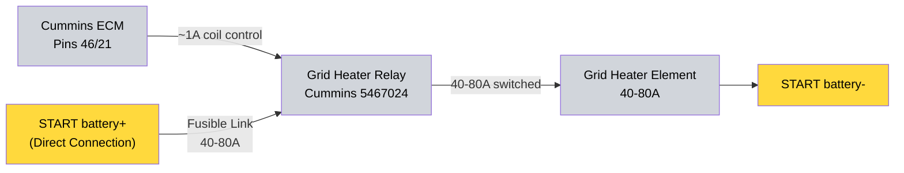

---
hide:
  - toc
tags:
  - product-details
  - engine-systems
  - grid-heater
  - cummins
---

# 2.7 Grid Heater System {#27-grid-heater-system}

/// html | div.product-info

**Type:** Cold-start air intake heater

**Model:** Grid Heater Relay

**Part Number:** Cummins 5467024

**Manufacturer:** Cummins

**Mounting:** Engine bay near intake manifold

**Power Source:** START battery+ direct (via fusible link, 40-80A) — ⚠️ current unverified[^grid-current]

[^grid-current]: ⚠️ UNVERIFIED. Cummins does not publish a current draw for grid-heater part 5467024 on the R2.8 (spec flyer 5410825 / install guide 5504137 give no amperage); commonly-cited 95-110A figures are for Dodge/Ram 5.9/6.7 heaters, not this part (checked 2026-05-30). The 40-80A / 80A element values are engineering estimates — confirm by element-resistance measurement during install (already tracked as a Verification item).

**Control:** Direct ECM control (pins 46/21)

///

## Specifications

| Spec              | Value                                              |
| :---------------- | :------------------------------------------------- |
| Type              | Cold-start air intake heater                       |
| Relay part number | Cummins 5467024                                    |
| Coil control      | ECM pins 46/21 (~0.5–1A)                           |
| Element current   | 40–80A (design estimate)[^grid-current]            |
| Duty cycle        | 3–5 s during cold start (ECM-controlled)           |
| Protection        | Integrated fusible link                            |

## System Architecture

1. **ECM Control (Direct):**
   - ECM triggers grid heater relay directly via pins 46/21 (~0.5-1A)
   - ECM manages timing, temperature thresholds, and duty cycle
   - No PMU involvement - ECM knows engine temperature better than external controller

2. **Grid Heater Relay (Cummins 5467024):**
   - Main Power: Direct from START battery+ via fusible link (bypasses all bus bars and PMU)
   - Main Ground: START battery- or NEGATIVE bus

3. **Grid Heater Element:**
   - Location: Intake manifold

## Wiring Summary

**Two-Stage Design:** ECM pins 46/21 (1A) → relay coil → relay switches high current (40-80A) directly from battery to element.

## Design Rationale

- ECM has accurate engine temperature data and manages timing/duty cycle directly — no PMU involvement needed, freeing PMU output slots for other systems
- High current draw (40-80A) for a very short duration (3-5 seconds) — direct battery connection with fusible link protection minimizes voltage drop and connection complexity, bypassing the CONSTANT bus bar and PMU outputs entirely

## Outstanding Items

{{ tbds() }}

## Related Documentation

- [PMU Power Distribution][pmu-power-distribution] - Engine bay power management
- [START Battery Distribution][starter-battery-distribution] - Direct battery connections

[install-checklist]: ../09-installation/02-engine-systems-checklist.md
[pmu-power-distribution]: ../01-power-systems/04-pmu/index.md
[starter-battery-distribution]: ../01-power-systems/02-starter-battery-distribution/index.md
