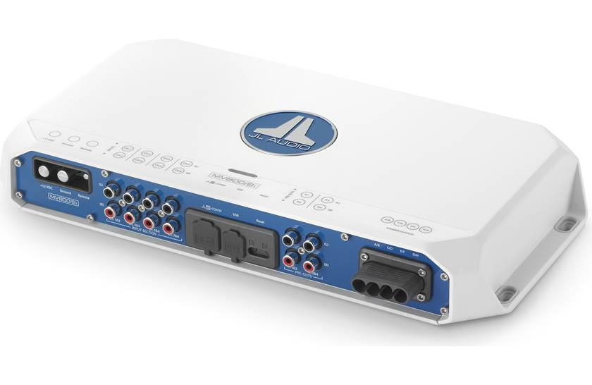

---
hide:
  - toc
tags:
  - product-details
  - audio-systems
  - jl-audio
---

# 6.2 Amplifier {#amplifier}

8-channel Class-D marine amplifier with integrated DSP. Each subwoofer runs on its own bridged channel pair @ 4Ω; four remaining channels drive the four cabin speakers.

/// html | div.product-info
{ loading=lazy }

**Type:** 8-Channel Marine Amplifier (with DSP)

**Model:** MV800/8i

**Part Number:** 010-03339-00

**Manufacturer:** JL Audio (Garmin)

**Product Page:** [JL Audio MV800/8i][product-link]

**Manual:** [Owner's Manual / Install Guide][manual-link]

**Mounting:** Under rear seat — vibration isolators on floor rivnuts (standoff air gap for Class-D convection; no fab plate)

**Power Source:** AUX battery+ direct via 100A inline CB (~3-4 ft, short feed)

///

## Specifications

All specs from the JL Audio MV800/8i Connection Guide unless otherwise noted.[^specs-manual]

| Spec                      |                                                                                Value |
| :------------------------ | -----------------------------------------------------------------------------------: |
| Topology                  |                            2nd-Gen NexD2™ High-Speed Class D, unregulated MOSFET PSU |
| Total Power               |                                                                          800W rated |
| RMS @ 14.4V               |                              8× 75W @ 4Ω · 8× 100W @ 2Ω · 4× 200W bridged @ 4Ω |
| RMS @ 12.5V               |                               8× 60W @ 4Ω · 8× 90W @ 2Ω · 4× 180W bridged @ 4Ω |
| Min Impedance             |                                                  4Ω bridged · 2Ω unbridged |
| Operating Voltage         |                                                                          10–15V DC |
| Standby Current           |                                                                  **2.4 mA** (negligible parasitic) |
| Recommended Fuse          |                                                                                  80A |
| Min Copper Power/GND Wire |                                                                                4 AWG |
| Power Terminal Capacity   |                                                          up to 2 AWG (no CCA — tinned Cu preferred) |
| Remote Turn-On Wire       |                                                                        18 – 10 AWG |
| Frequency Response        |                                                            12 Hz – 21 kHz (+0, −1 dB) |
| THD+N @ rated RMS         |                                                                                 <1% |
| Damping Factor            |                                              >100 / 50 Hz @ 4Ω · >50 / 50 Hz @ 2Ω |
| DSP                       |                  AKM AK7738, 24-bit / 48 kHz — LPF/HPF/slope/EQ/bass boost via TüN |
| Analog Input Range        |                                       250 mV – 16 V RMS (speaker-level capable, no LOC) |
| Signal-to-Noise           |                                          99 dB (ref rated power), 80 dB (ref 1 W), A-wtd |
| Preamp Outputs            |                                                            4× line-level, 4 V RMS max |
| Cooling                   |                                                  Convection (no fan); 1" (2.5 cm) free space above shell required if enclosed |
| IP Rating                 |                                          IPX2 (mounted vertically, connections down) |
| Dimensions (L × W × H)    |     13.96" × 6.93" × 2.05" / 355 × 176 × 52 mm (chassis; connector clearance adds ~1.4" depth) |
| Weight                    |                                                                              5.6 lbs |
| Warranty                  |                                                                  2 years parts + labor |

[^specs-manual]: JL Audio MV800/8i Connection Guide (`MV800/8i_MAN_071519`), pp. 2–4, on file at `~/Downloads/13698649.pdf` (Crutchfield manual mirror, retrieved 2026-06-01). Dimensions cross-checked against Garmin PH product page; Crutchfield's "14" × 8-3/8"" figure includes connector clearance beyond the chassis L×W.

## Channel Configuration

| Channels | Mode             |   Output | Load                               |
| :------- | :--------------- | -------: | :--------------------------------- |
| Ch 1+2   | Bridged @ 4Ω     | 200W RMS | Sub A (rear quarter, driver side)  |
| Ch 3+4   | Bridged @ 4Ω     | 200W RMS | Sub B (rear quarter, pass. side)   |
| Ch 5     | Stereo @ 4Ω      |  75W RMS | Front Left                         |
| Ch 6     | Stereo @ 4Ω      |  75W RMS | Front Right                        |
| Ch 7     | Stereo @ 4Ω      |  75W RMS | Rear Left                          |
| Ch 8     | Stereo @ 4Ω      |  75W RMS | Rear Right                         |

Each sub gets a dedicated bridged pair at 4Ω — directly matches the JL M6-8IB-S-GmTi-i-4 RMS rating (200W @ 4Ω SVC). No series wiring, no impedance mismatch, independent per-sub gain/EQ/delay via onboard DSP.

## Onboard DSP

Integrated DSP (AKM AK7738, 24-bit / 48 kHz) supports per-channel:

- Parametric EQ
- Time-alignment delay
- Crossover (HPF/LPF) with selectable slope
- Bass boost
- Signal routing & mixing (e.g. summing left/right sub-RCA to both bridged sub pairs)

Configured via JL Audio TüN software:

- **USB (PC/Mac)** — laptop with USB A/B cable to the amp's USB port. Fallback method.
- **Bluetooth** — via the [VXi-BTC][bt-tuning] (JLid Bluetooth Communicator), wired to the amp's JLid-COMM port. Phone/tablet running TüN Mobile or TüN Express. **Primary tuning method on this build.**

The amp's single JLid-COMM port is occupied by the VXi-BTC; no M-DRC-50 preset selector is installed (see [Bluetooth Tuning page → Design Decisions][bt-tuning] for rationale).

## Bridged Speaker Wiring (Sub Pairs)

The MV800/8i ships with **four 2-channel speaker harnesses** (A/B, C/D, E/F, G/H). For each bridged pair, the (+) lead is on the lower-channel harness and the (−) lead is on the *adjacent* harness — the bridged pair spans two harnesses, not one.[^specs-manual]

| Bridged Pair | (+) wire (from harness)  | (−) wire (from harness)     |
| :----------- | :----------------------- | :-------------------------- |
| **Ch 1+2 → Sub A** | White (harness A)  | Gray/Black (harness B)      |
| **Ch 3+4 → Sub B** | Green (harness C)  | Purple/Black (harness D)    |

The unused leads on the same harnesses (Gray + White/Black on harness A/B; Purple + Green/Black on harness C/D) are **not connected** when running that pair bridged. Cap or trim them at the harness; do not connect to anything.

Ch 5/6 (front speakers) and Ch 7/8 (rear speakers) run stereo unbridged from harnesses E/F and G/H respectively — standard +/− per channel.

## Wiring

| Connection | Wire     | Source          | Notes                                                 |
| :--------- | :------- | :-------------- | :---------------------------------------------------- |
| Power (+)  | 4 AWG    | AUX battery+ direct | Via 100A inline CB at battery (~3-4 ft)            |
| Ground (−) | 4 AWG    | AUX battery (−)     | Direct to terminal (~3-4 ft)                       |
| Remote     | 18 AWG   | MS-RA670        | Turn-on signal, bundled w/ RCA through trans tunnel   |
| RCA Zone 1 | Shielded | MS-RA670        | Ch 5+6 (front), ~10-12 ft — high-quality shielded     |
| RCA Zone 2 | Shielded | MS-RA670        | Ch 7+8 (rear), ~10-12 ft                              |
| RCA Sub    | Shielded | MS-RA670        | Summed to Ch 1+2 and Ch 3+4 (bridged subs), ~10-12 ft |

**Sub RCA routing:** The MS-RA670 has a single mono sub-out. Route it into one amp input and mirror it to both bridged sub pairs (Ch 1+2 and Ch 3+4) via the onboard DSP signal routing — no Y-splitter required.

## Circuit Protection

The MV800/8i has an internal 80A fuse (primary amp protection). External protection at the AUX battery protects the supply wire:

- **Breaker:** Blue Sea 187-100A (100A) thermal circuit breaker
- Protects 4 AWG wiring (rated 95A continuous, 100A acceptable for ~3-4 ft run)
- Mount inline within 7" of AUX battery+ terminal (5th stacked lug)

The 100A external CB is intentionally above the 80A internal fuse — the internal fuse remains the primary trip path under amp fault, while the external CB protects the wire from a short upstream of the amp.

## Mounting Location

**Under rear seat (driver side), bolted directly to the floor pan — no fab plate**

- Mounted on **vibration isolators** (rubber standoffs) into **rivnuts** set in the floor pan. The isolator standoff height raises the chassis off the floor, giving the convection air gap underneath; no fabricated mounting plate.
- Allow a **14" × 8-3/8"** floor footprint (chassis L×W plus connector clearance)[^specs-manual] and **verify clearance from the seat slider rails** before drilling rivnuts.
- Maintain at least **1" (2.5 cm) clear air space above the shell** (manual requirement for enclosed-compartment mounting); convection-cooled, no fan.
- Power feed ~3-4 ft direct from AUX battery+ (short feed, low loss)
- Ground return ~3-4 ft to AUX battery−. All system grounds (head unit + amp) should land at the same point per the manual to avoid ground loops.[^specs-manual]
- Centroid to all 4 speakers + 2 subs — minimizes speaker wire runs
- RCA + remote bundled together from head unit through trans tunnel (~10-12 ft, high-quality shielded RCA required to avoid alternator whine)
- Orient with connections pointing downward where practical (preserves IPX2 rating)
- USB access (front of chassis) needed for TüN DSP tuning — leave service loop

## Outstanding Items

{{ tbds() }}

## Build Tasks

- [ ] DSP configuration: corner frequencies, sub delay, channel gain matching (set during install with TüN software + measurement)

## Related Documentation

- [Audio Systems Overview][audio-overview]
- [Head Unit][head-unit]
- [Speakers][speakers]
- [Subwoofer][subwoofer]
- [AUX Battery Distribution][aux-distribution]

[audio-overview]: index.md
[head-unit]: 01-head-unit.md
[speakers]: 03-speakers.md
[subwoofer]: 04-subwoofer.md
[aux-distribution]: ../01-power-systems/03-aux-battery-distribution/index.md
[bt-tuning]: 06-bluetooth-tuning.md
[product-link]: https://www.garmin.com/en-US/p/1707541/pn/010-03339-00
[manual-link]: https://support.garmin.com/en-US/?partNumber=010-03339-00&tab=manuals
