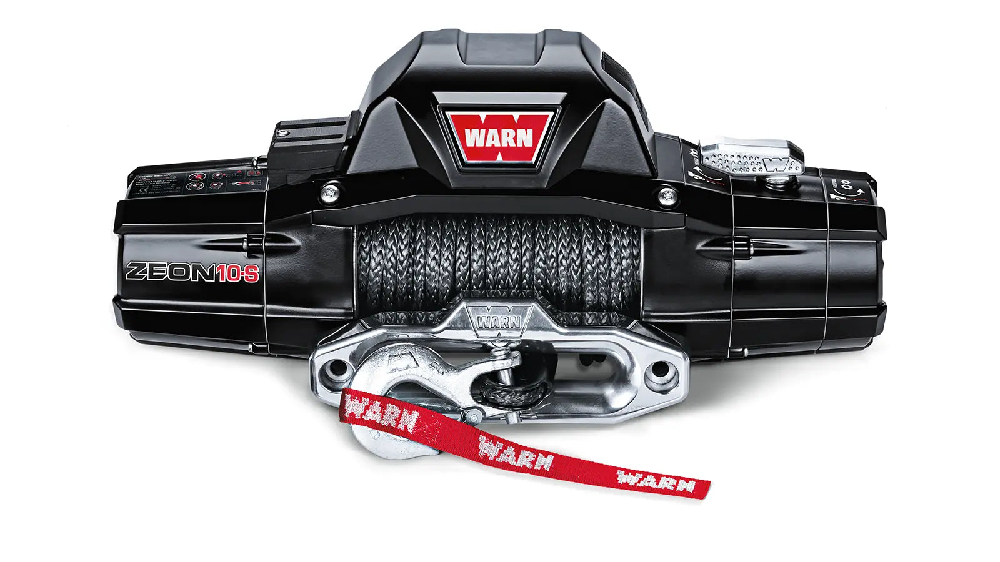

---
hide:
  - toc
tags:
  - product-details
  - exterior-systems
  - winch
  - recovery
---

# 8.1 Winch {#winch}

/// html | div.product-info

**Model:** Warn Zeon 10-S

**Mounting Location:** Front bumper (verified compatible)

**Pulling Capacity:** 10,000 lbs (4,536 kg)

**Motor:** 12V DC series wound

///

**Product Image:**

## Electrical Specifications

- **Peak Amperage Draw:** 409A (at full load/stall - brief periods only)[^winch-model]
- **Typical Operating Draw:** 80-250A (most recovery operations)
- **Main Power Source:** AUX battery (passenger rear wheel well - direct connection, no fuse/breaker)
  - See [AUX Battery Distribution][aux-battery] for wire specs (gauge, length, routing, voltage drop calculations)
  - **System Voltage:** 13.8V (alternator charging - engine running during winch operations)
  - **Protection:** None - direct connection (see justification below)

[^winch-model]: Model confirmed **WARN ZEON 10-S** (owner, 2026-05-30) — the earlier "ZEON 10-S" naming was incorrect. WARN's published peak draw for the ZEON 10-S is **409A @ 10,000 lb** (pull table: 62/144/215/280/353/409A); the previously documented 450A (≈ ZEON Platinum) was conservative. 1/0 AWG cable and the integrated contactor retain margin above 409A; WARN service battery leads for the 10-S are **2 AWG** (our 1/0 AWG is a deliberate upsize). Source: [WARN ZEON 10-S (89611)](https://www.warn.com/products/zeon-10-s-89611) (checked 2026-05-30).

## Circuit Protection {#winch-circuit-protection}

No external circuit breaker — per the [WARN ZEON 10-S installation manual][warn-manual]. Protection: integrated thermal cutoff, contactor isolation (emergency shutoff: disconnect at battery terminal), and 1/0 AWG cable (adequate for 409A brief peaks). Automotive practice (SAE J1128) differs from marine (ABYC E-11), which fuses all circuits. See [Standards Exceptions][standards-exceptions].

## Contactor/Solenoid

- **Type:** Warn Zeon 10-S integrated contactor (included with winch)
- **Location:** Mounted on winch motor housing
- **Rating:** Rated for full stall current (≥409A switching)
- **Function:** High-current switching for winch motor direction and power

## Control System

**Dual Control Setup:** Dash rocker switch + handheld remote (both work simultaneously)

**Dash Switch:**

- **Type:** [CH4X4-TOY-D-WINIO][ch4x4-winch] dual-momentary pushbutton, Toyota-style (see Wiring, below, for pinout)
- **Location:** Dashboard physical switch panel
- **Power:** BODY PDU CB43 (10A)
- **Use case:** In-cab winch control (self-recovery, convenient operation from driver seat)

**Handheld Remote:**

- **Type:** Warn factory wired remote (included with Zeon 10-S)
- **Function:** IN/OUT directional control (same as dash rocker)
- **Connection:** Plugs into winch control pack
- **Use case:** Outside vehicle spotting (traditional winch operation with visual line of sight)

## Wiring

**Main Power Wiring:**

See [AUX Battery Distribution][aux-battery] for wire specs (gauge, length, routing path).

- **Positive (+):** AUX battery+ → winch contactor → winch motor (direct, no breaker)
- **Negative (-):** AUX battery- → winch motor ground lug

**Control Wiring:**

- **Power Source:** BODY PDU CB43 (10A fuse) - sourced from Firewall CONSTANT Bus (AUX battery)
- **Dash Switch:** [CH4X4-TOY-D-WINIO][ch4x4-winch] dual-momentary push, Toyota-style (1.54" × 0.83" cutout) - see [Dashboard Controls][dashboard-controls]
- **Signal Path:** BODY PDU CB43 → CH4X4 switch (push IN or OUT) → HDP24 pins 16/17 → winch contactor IN/OUT triggers
- **Remote:** Wired in parallel with dash switch at contactor IN/OUT trigger terminals
- **Wire Gauge:** 18 AWG (low-current trigger signals, ~2A max each direction)
- **Routing:** BODY PDU (firewall cabin side) → ~3 ft to dash switch → out through HDP24 → engine bay → winch contactor (front bumper)

| Circuit         | Source             | Protection            | Wire Gauge                                                 | Destination             | Function            |
| --------------- | ------------------ | --------------------- | ---------------------------------------------------------- | ----------------------- | ------------------- |
| Main Power (+)  | AUX battery+       | None (direct)         | See [AUX Battery Distribution][aux-battery] for wire specs | Winch Contactor → Motor | High-current power  |
| Main Power (-)  | AUX battery-       | None                  | See [AUX Battery Distribution][aux-battery] for wire specs | Winch Motor Ground      | High-current return |
| Trigger IN      | CH4X4 IN button    | BODY PDU CB43 (10A)   | 18 AWG                                                     | Winch Contactor IN trig | Low-current trigger |
| Trigger OUT     | CH4X4 OUT button   | BODY PDU CB43 (10A)   | 18 AWG                                                     | Winch Contactor OUT trig| Low-current trigger |
| Remote Control  | Warn Remote        | Internal to winch     | Per Warn specs                                             | Winch Control Pack      | Parallel to dash    |

[ch4x4-winch]: https://ch4x4.com/product/ch4x4-momentary-dual-push-switch-for-toyota-winch-in-out-symbol/
[dashboard-controls]: ../05-control-interfaces/05-dashboard-controls.md

## Installation

**Power Cable Routing:**

See [AUX Battery Distribution][aux-battery] for cable specs and routing path.

- **Route:** Passenger rear wheel well → front bumper (~13 ft, exact path: {{ tbd(106) }} - avoid exposed frame rail per offroad protection requirement)

## Outstanding Items

{{ tbds() }}

## Related Documentation

- [AUX Battery Distribution][aux-battery] - Winch power source (passenger rear wheel well)
- [Wire Distance Reference][wire-distance] - Winch to battery routing distance (13 ft one-way, 26 ft circuit)
- [SafetyHub][safetyhub] - Winch contactor trigger circuit protection
- [Air Compressor][air-compressor] - ARB compressor for tire inflation

[aux-battery]: ../01-power-systems/03-aux-battery-distribution/index.md
[wire-distance]: ../01-power-systems/01-power-generation/05-wire-distance-reference.md
[safetyhub]: ../01-power-systems/03-aux-battery-distribution/04-safetyhub.md
[air-compressor]: 02-air-compressor.md
[warn-manual]: https://www.warn.com/products/zeon-10-s-89611
[standards-exceptions]: ../01-power-systems/STANDARDS-EXCEPTIONS.md
