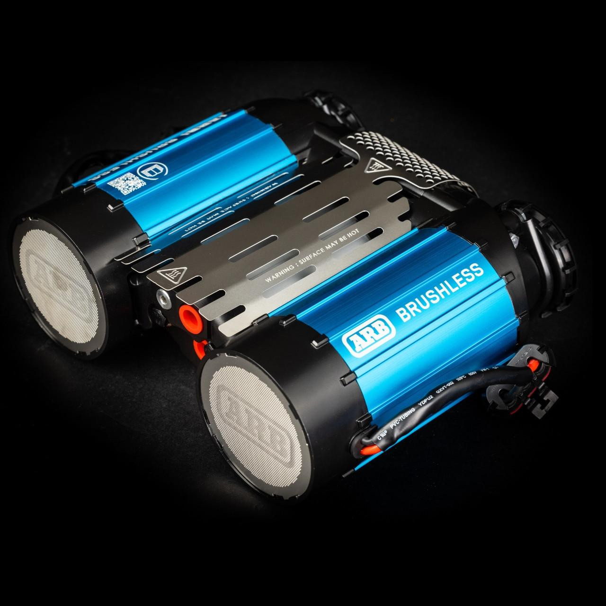
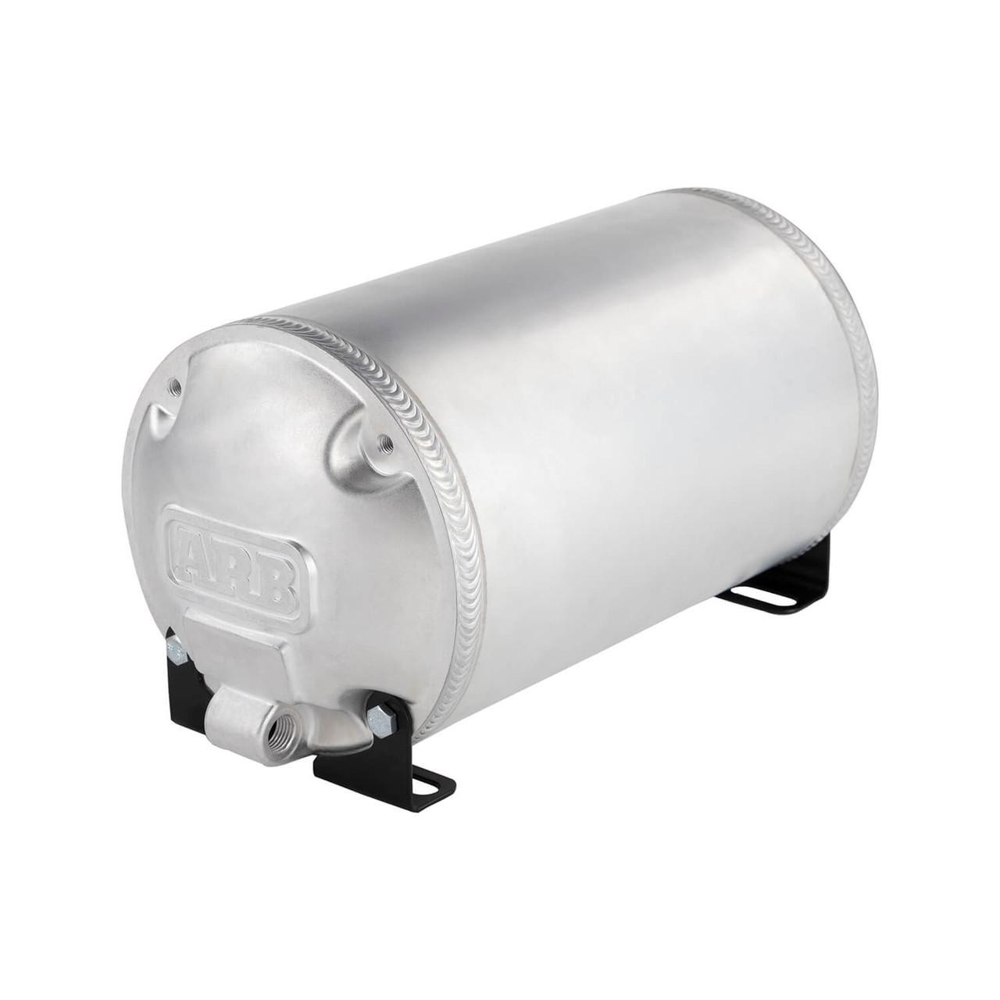
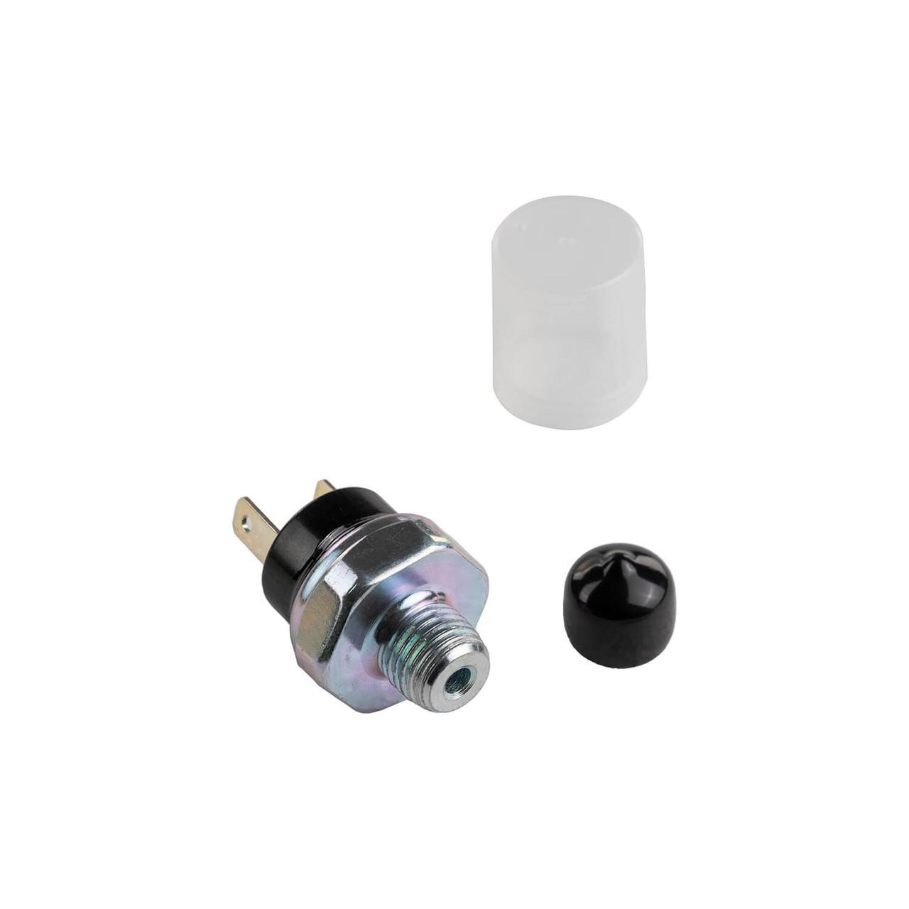

---
hide:
  - toc
tags:
  - product-details
  - exterior-systems
  - air-compressor
  - arb
---

# 8.2 Air Compressor {#air-compressor}

ARB Twin Compressor system with air tank and automatic pressure management for locker operation and tire inflation.

/// html | div.product-info

**Model:** ARB CKBLTA12 Brushless Twin Motor Onboard 12V Air Compressor

**Status:** Purchased

**Product Page:** [ARB CKBLTA12](https://store.arbusa.com/brushless-twin-motor-onboard-12v-air-compressor-ckblta12/)

**Installation Guide:** [ARB CKBLTA12 Installation PDF](https://store.arbusa.com/content/CKBLTA12%20INST.pdf)

**Maximum Amperage Draw:** 90A total (45A per motor × 2 motors)[^arb-current]

**Fuse Configuration:** Dual 60A MIDI fuses via SafetyHub 150 (one per motor)[^arb-current]

[^arb-current]: ARB publishes **Max Amps 90** (total) for the CKBLTA12 brushless twin — matches our doc. The **45A per motor** is the 90÷2 split (ARB does not publish a per-motor figure), and the **60A MIDI fuse per motor** is this build's protection choice (not an ARB-specified value), sized above the ~45A per-motor draw. Source: [ARB CKBLTA12 product page](https://store.arbusa.com/brushless-twin-motor-onboard-12v-air-compressor-ckblta12/) (checked 2026-05-30). NB: this is the brushless CKBLTA12 — do not apply specs from the older brushed CKMTA12 (28A/50A, 40A fuse), which is a different unit.

**Location:** Under passenger seat

///

**Product Image:**

## Specifications

| Spec                  | Value                              |
| --------------------- | ---------------------------------- |
| Motor Type            | Brushless, twin motor              |
| Voltage               | 12V                                |
| Max Amperage          | 90A total (45A per motor)          |
| Duty Cycle            | 100%                               |
| Maximum Pressure      | 150 PSI                            |
| Air Flow @ 0 PSI      | 9.18 CFM                           |
| Air Flow @ 29 PSI     | 6.20 CFM                           |
| Cooling               | Active cooling with built-in fans  |
| Smart Start           | Staggered motor power-on           |
| Electronic Control    | Speed control for temp/pressure    |
| IP Rating             | IP67 water resistant               |
| Dimensions (L×W×H)    | 14.49" × 13.31" × 6.69"            |
| Weight                | 15.8 lb (complete), 13.2 lb (bare) |
| Warranty              | 3 years                            |

## Control System

- **Control:** SwitchPros OUTPUT-11 (15A output, Button 11)
  - OUTPUT-11 provides switched 12V control signal to compressor
  - Compressor has internal relay/control that handles high-current motor switching
  - 14 AWG wire from OUTPUT-11 to compressor control terminal
- **Ground:** 6 AWG black wire from compressor to AUX battery negative (direct connection for 90A return current)

## Wiring

| Circuit       | Source                       | Destination                 | Wire  | Protection | Notes                         |
| ------------- | ---------------------------- | --------------------------- | ----- | ---------- | ----------------------------- |
| Motor 1 Power | SafetyHub MIDI-1 (60A)       | Compressor motor 1 positive | 6 AWG | 60A MIDI   | Via SafetyHub 150A CB         |
| Motor 2 Power | SafetyHub MIDI-2 (60A)       | Compressor motor 2 positive | 6 AWG | 60A MIDI   | Via SafetyHub 150A CB         |
| Ground        | Compressor negative terminal | AUX battery negative        | 6 AWG | None       | Direct for 90A return current |
| Control       | SwitchPros OUTPUT-11         | Compressor control terminal | 14 AWG | 15A        | Auto or manual activation     |

---

## Air Tank

### ARB 1-Gallon Air Tank

**Model:** ARB 171507 (Aluminum, 1-gallon, 4-port)

**Status:** To purchase (targeting 1-gallon capacity)

**Product Page:** [ARB 171507 Aluminum 1-Gallon Air Tank](https://store.arbusa.com/aluminum-compressor-air-tank-with-1-gallon-capacity-and-4-ports-171507/)

**Product Image:**

| Spec             | Value                                |
| ---------------- | ------------------------------------ |
| Capacity         | 1 gallon (4 liters)                  |
| Working Pressure | 150 PSI maximum                      |
| Material         | Forged aluminum end caps + extruded aluminum body (~50% lighter than steel) |
| Mounting         | Under passenger seat (horizontal or vertical) |
| Ports            | 4 × 1/4" NPT (daisy-chain compatible) |

---

## Pressure Switch

### ARB Pressure Switch

**Model:** ARB 180901

**Status:** Purchased

**Product Page:** [ARB Pressure Switch](https://store.arbusa.com/compressor-pressure-switch-180901/)

**Product Image:**

| Spec             | Value                    |
| ---------------- | ------------------------ |
| Cut-In Pressure  | 135 PSI (compressor starts) |
| Cut-Out Pressure | 150 PSI (compressor stops)  |
| Mounting         | On air manifold          |
| Electrical       | Low-current switch (<1A) |

---

## Air Manifold

**Configuration:** 4-6 port brass manifold

**Status:** Purchased

**Location:** Under passenger seat (with compressor and tank)

**Port Assignments:**

1. **Input:** Compressor output → manifold input
2. **Output 1:** Manifold → Front locker solenoid (1/4" air line)
3. **Output 2:** Manifold → Rear locker solenoid (1/4" air line)
4. **Output 3:** Manifold → [Rear Air Chuck Plate][rear-air-chuck] (1/4" air line)
5. **Output 4:** Manifold → Pressure gauge (0-200 PSI, panel-mounted)
6. **Output 5:** Manifold → Pressure switch (ARB 180901)

---

## Automatic Pressure Control

Tank pressure switch (ARB 180901) drives compressor auto-cycling between 135-150 PSI via SwitchPros TRIGGER-3 → OUTPUT-11, with Button 11 available as a manual override for tire inflation. See [SwitchPros][switchpros] for the trigger logic, wiring, and configuration.

---

## Outstanding Items

{{ tbds() }}

## Build Tasks

- [ ] Verify ARB CKBLTA12 wiring harness connector pinout for motor 1, motor 2, and control terminals
- [ ] Confirm under-seat mounting bracket/location for compressor and 1-gallon tank
- [ ] Purchase ARB 171507 1-gallon aluminum air tank
- [ ] Order 0-200 PSI pressure gauge (panel-mount or in-line)

## Related Documentation

- [Air Lockers][air-lockers] - ARB RD116 front/rear lockers
- [Rear Air Chuck][rear-air-chuck] - External air access plate
- [SafetyHub][safetyhub] - Compressor power distribution
- [SwitchPros][switchpros] - Compressor control (OUTPUT-11, TRIGGER-3)

[air-lockers]: 03-air-lockers.md
[rear-air-chuck]: 04-rear-air-chuck.md
[safetyhub]: ../01-power-systems/03-aux-battery-distribution/04-safetyhub.md
[switchpros]: ../05-control-interfaces/02-switchpros-sp1200.md
