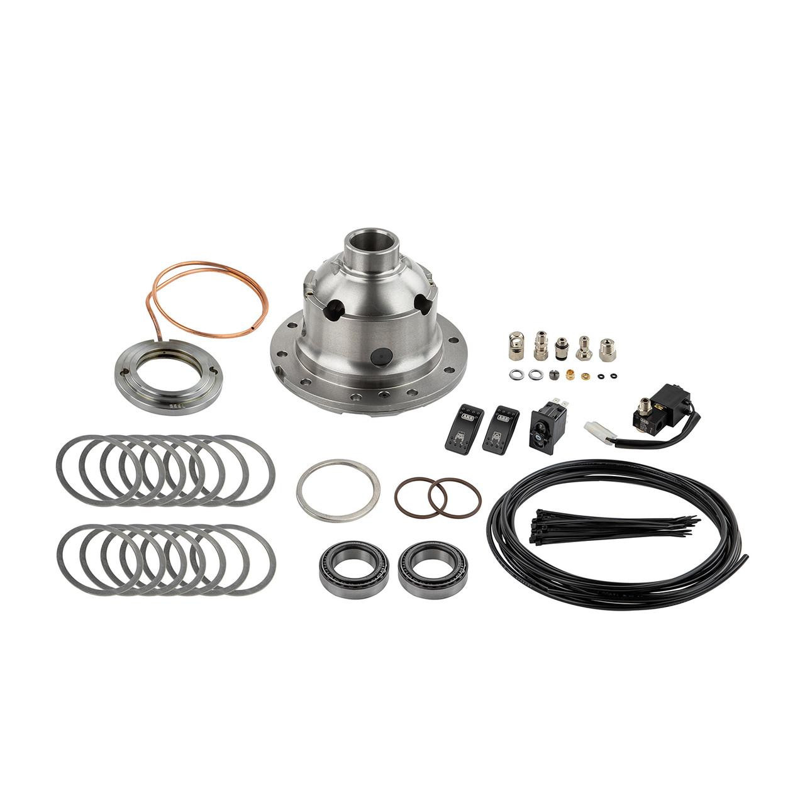

---
hide:
  - toc
tags:
  - product-details
  - exterior-systems
  - air-lockers
  - arb
---

# 8.3 Air Lockers {#air-lockers}

ARB air-operated locking differentials: RD116 in the Dana 44 front, RD140 in the Sterling 10.5 rear.

/// html | div.product-info

**Front:** ARB RD116 Air Locker — Dana 44, 30 spline, 3.92 & up

**Rear:** ARB RD140 Air Locker — Sterling 10.5, 35 spline, all ratios

**Front Locker Control:** SwitchPros OUTPUT-17 (low-side driver, 2A)

**Rear Locker Control:** SwitchPros OUTPUT-10 (15A output, 2A draw)

**Air Source:** [ARB Twin Compressor][air-compressor] via manifold

///

**Product Image:**

## Specifications

| Spec              | Front Locker          | Rear Locker           |
| ----------------- | --------------------- | --------------------- |
| Model             | ARB RD116             | ARB RD140             |
| Axle              | Dana 44               | Sterling 10.5         |
| Spline Count      | 30                    | 35                    |
| Gear Ratio        | 5.13                  | 5.13                  |
| Solenoid Draw     | ~2A                   | ~2A                   |
| SwitchPros Output | OUTPUT-17 (low-side)  | OUTPUT-10 (15A)       |
| SwitchPros Button | Button 9              | Button 10             |

## Wiring

### Solenoid Control

| Locker | SwitchPros Output | Wire   | Route                                               |
| ------ | ----------------- | ------ | --------------------------------------------------- |
| Front  | OUTPUT-17         | 18 AWG | Passenger rear wheel well → front axle (~12 ft, routing {{ tbd(81) }}) |
| Rear   | OUTPUT-10         | 18 AWG | Passenger rear wheel well → rear axle (~6 ft)                |

### Wire Routing

- **Front Locker (OUTPUT-17):** SwitchPros (passenger rear wheel well) → along driver frame rail → to front axle solenoid (~12 ft)
  - Wire: 18 AWG (2A load, low-side driver output)
  - Protection: Split loom, P-clamps every 18", secure to frame rail
- **Rear Locker (OUTPUT-10):** SwitchPros (passenger rear wheel well) → to rear axle solenoid (~6 ft)
  - Wire: 18 AWG (2A load)
  - Protection: Split loom where exposed, secure to axle housing

## Air Line Routing

!!! info "Air Line Installation"
    Air lines from manifold must be routed to both axles with proper protection from heat, abrasion, and road debris.

| Line         | Route                                                          | Length |
| ------------ | -------------------------------------------------------------- | ------ |
| Front Locker | Manifold (under seat) → along driver frame rail → front axle   | ~12 ft |
| Rear Locker  | Manifold (under seat) → to rear axle                           | ~6 ft  |

**Air Line Specifications:**

- **Type:** ARB air line kit (1/4" OD nylon tubing, 200 PSI rated)
- **Fittings:** Push-to-connect fittings at manifold and locker ends

**Protection:**

- Split loom over entire run where exposed to road debris
- P-clamps every 12" along frame rail
- High-temp silicone sleeve where crossing near exhaust (6" minimum clearance)
- Rubber grommets at body/frame penetrations

## Operation

### Engagement Sequence

**Front Locker:**

1. Press Button 9 (OUTPUT-17)
2. Solenoid opens, pressurized air from tank → front locker
3. Front differential locks **instantly** (no waiting for compressor)
4. Release Button 9 to disengage

**Rear Locker:**

1. Press Button 10 (OUTPUT-10)
2. Solenoid opens, pressurized air from tank → rear locker
3. Rear differential locks **instantly**
4. Release Button 10 to disengage

**Automatic Refill:**

- After multiple locker uses, tank pressure drops below 135 PSI
- Pressure switch automatically activates compressor to refill tank
- No user action required

## Safety Considerations

!!! warning "Locker Operation"
    - Only engage lockers at low speeds (typically <5 mph)
    - Disengage lockers before returning to normal speeds
    - Never engage lockers on dry pavement
    - Ensure adequate air pressure before engaging lockers

## Outstanding Items

{{ tbds() }}

## Build Tasks

- [ ] Order ARB air line installation kit with 1/4" fittings for front/rear lockers

## Related Documentation

- [Air Compressor][air-compressor] - ARB Twin Compressor and air tank
- [SwitchPros][switchpros] - Locker control (OUTPUT-10, OUTPUT-17)
- [Front Axle][front-axle] - Dana 44, RD116
- [Rear Axle][rear-axle] - Sterling 10.5, RD140

[air-compressor]: 02-air-compressor.md
[switchpros]: ../05-control-interfaces/02-switchpros-sp1200.md
[front-axle]: ../10-drivetrain/04-front-axle.md
[rear-axle]: ../10-drivetrain/05-rear-axle.md
