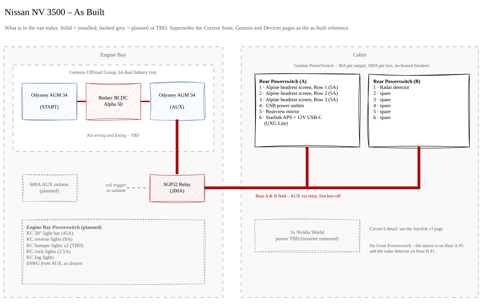

---
hide:
  - toc
tags:
  - power-distribution
---

# 1.3 Switch Panels {#switch-panels}

Accessory loads hang off [Garmin PowerSwitch][garmin-spec] boxes. Each box has
six digitally switched outputs rated **30 A max per output, 100 A max per
box**, at 12-16 V. There are no branch breakers: the PowerSwitch output is the
protection, so **every branch conductor must be sized for 30 A**, not for the
load's expected draw.

Two panels are installed today, **Rear Powerswitch (A)** and **Rear
Powerswitch (B)**. Both are fed from the AUX battery through the SGP32 relay
(see [Batteries & Charging](02-batteries-charging.md#sgp32-relay)), and their
circuits can run with the key off.
A third panel, the **Engine Bay Powerswitch**, is planned.

*Diagram source: `Van Electrical.drawio` (page "As Built"); the image is regenerated from the draw.io file on each export.*

---

## Rear Powerswitch (A) {#rear-a}

| Circuit | Load | Draw | Notes |
| :------ | :--- | :--- | :---- |
| 1 | Alpine PKG-RES3HDMI headrest screen, Row 1 | 5 A | HDMI from an Nvidia Shield |
| 2 | Alpine PKG-RES3HDMI headrest screen, Row 2 | 5 A | HDMI from an Nvidia Shield |
| 3 | Alpine PKG-RES3HDMI headrest screen, Row 3 | 5 A | HDMI from an Nvidia Shield |
| 4 | USB power outlets | TBD | |
| 5 | Rearview mirror | TBD | |
| 6 | Starlink Advanced Power Supply + 12 V USB-C outlet (UXG Lite) | Up to ~20 A + 3 A | Shared circuit; both switch together. See [Starlink Power](01-starlink-power.md#circuit) |

!!! note "Nvidia Shields have no power source yet"
    The three Nvidia Shields feeding the headrest screens ran from the 1000 W
    inverter on the *Current State* drawing. The inverter has been removed, and
    how the Shields will be powered is **TBD**. The *Devices* redesign puts
    them on Rear Powerswitch (A) alongside the screens, but circuits 1-6 are
    all taken.

---

## Rear Powerswitch (B) {#rear-b}

| Circuit | Load | Draw | Notes |
| :------ | :--- | :--- | :---- |
| 1 | Radar detector | 2 A | |
| 2 | Spare | - | |
| 3 | Spare | - | |
| 4 | Spare | - | |
| 5 | Spare | - | |
| 6 | Spare | - | |

!!! info "The Devices drawing is not the as-built for Rear (B)"
    The *Devices* redesign loads Rear Powerswitch (B) with Starlink, USB power
    outlets, Twinkle Lights, and two 5 V USB-C buck converters feeding a UniFi
    USW-Flex-Mini and the UXG Lite. None of that is on (B): Starlink and the
    UXG Lite moved to Rear (A) circuit 6, the USW-Flex-Mini is not in use, and
    Twinkle Lights are not planned. The Devices drawing also shows a **Front
    Powerswitch** (Midland MXTX575, rearview mirror, radar detector) that does
    not exist. The mirror is on Rear (A) circuit 5 and the radar detector on
    Rear (B) circuit 1. The radio is a Midland **MXT575**, moving over from the
    Jeep LJ (owner, 2026-09-25); which circuit powers it is not decided.

---

## Engine Bay Powerswitch (planned) {#engine-bay}

**Not installed.** As drawn, it is fed from the AUX battery on 0 AWG and carries
the KC exterior lighting:

| Load | Draw | Control (per drawing legend) |
| :--- | :--- | :--------------------------- |
| KC 50" light bar | 45 A | Power switched |
| KC reverse lights | 8 A | Power switched & physical |
| KC bumper lights (x2) | TBD | Power switched |
| KC rock lights | 2.5 A | Power switched |
| KC fog lights | TBD | Power switched & physical |

!!! warning "The light bar exceeds one PowerSwitch output"
    A 45 A light bar is over the PowerSwitch's **30 A per-output** limit. It
    cannot run straight from one output; it needs a relay triggered by the
    output, with its own fused feed. Resolve this before the panel is wired.

The drawings don't assign circuit numbers on this panel.

---

## Outstanding Items

- [ ] Decide how the 3x Nvidia Shields are powered now that the inverter is out (Rear (B) has five spare circuits)
- [ ] Decide where the Shields' network connections land now that the USW-Flex-Mini is out
- [ ] Measure and record draw for Rear (A) circuits 4 (USB outlets) and 5 (rearview mirror)
- [ ] Record wire gauge and run length for every branch circuit; each must be rated for the 30 A output, not the load
- [ ] Confirm Rear Powerswitch (A)'s trigger inputs - the *Current State* drawing wires **REVERSE** and **ACC** to its control header (the rearview mirror likely uses REVERSE for its camera)
- [ ] Engine Bay Powerswitch: settle how the 45 A light bar is driven, record the KC bumper and fog light draw, and assign circuit numbers
- [ ] Update the *Devices* drawing, or mark it superseded, now that the *As Built* page exists

[garmin-spec]: https://www8.garmin.com/manuals/webhelp/GUID-16B1D74D-857B-4FFB-8DE2-A0960FE0D090/EN-US/GUID-E9A53DAE-B84A-4E4F-9488-5536604B1779.html
