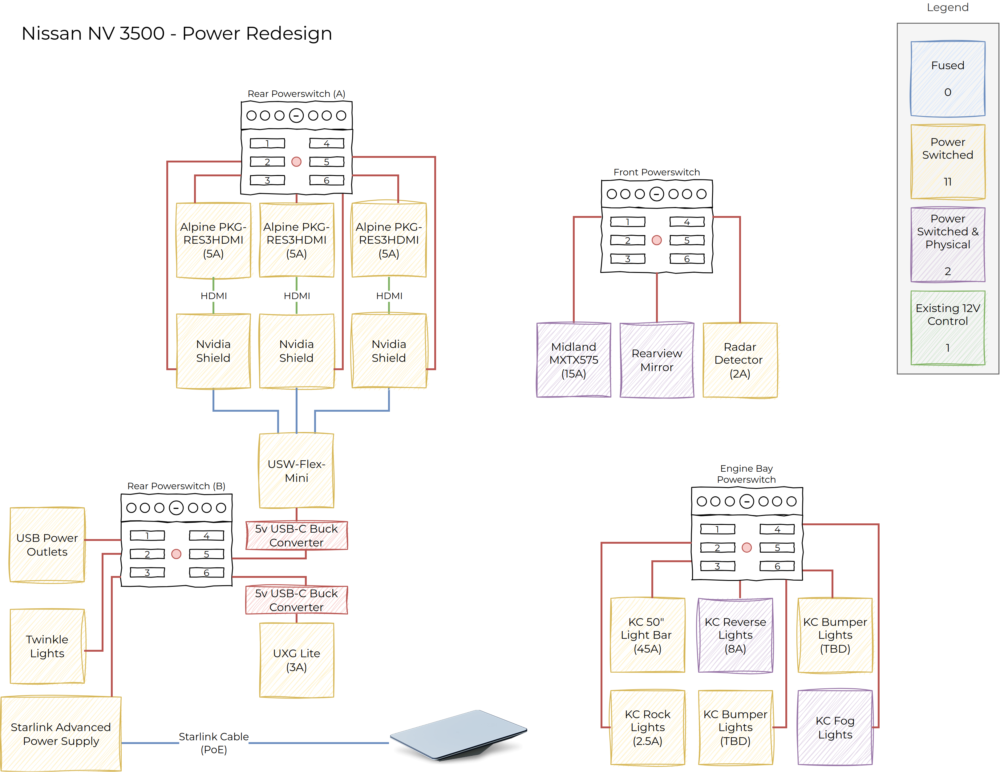
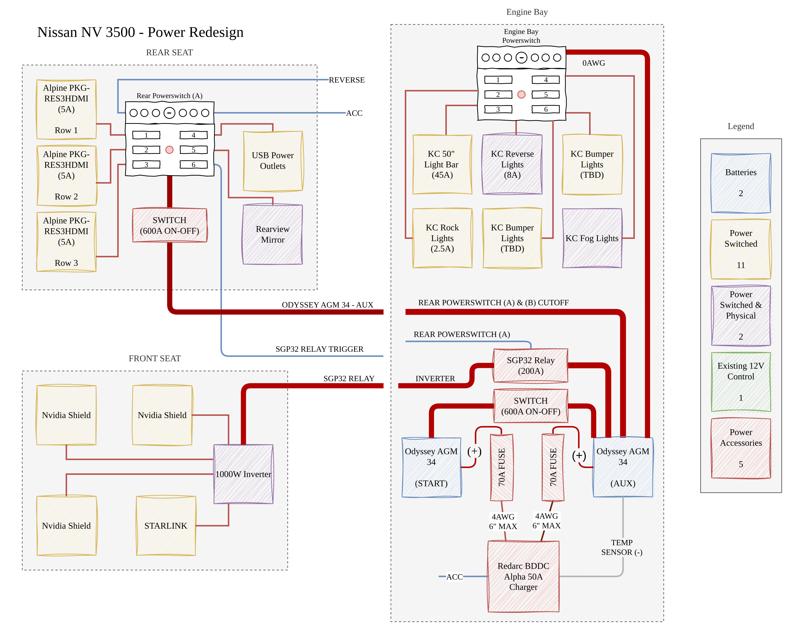
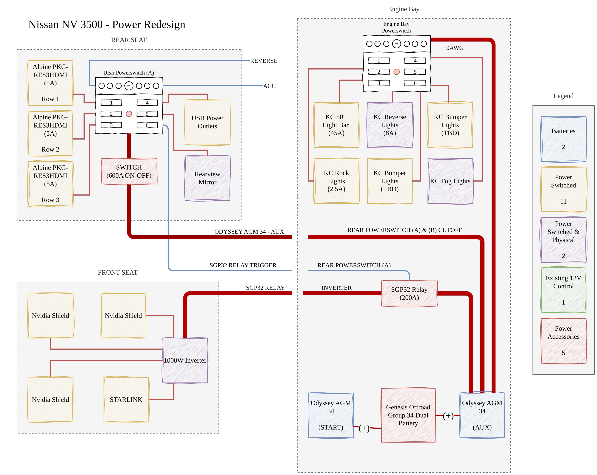

---
hide:
  - toc
tags:
  - diagrams
---

# Section 2: Diagrams {#diagrams}

Every drawing on this page is a page of **`Van Electrical.drawio`** at the
repository root. The draw.io file is the source of truth - these PNGs are
regenerated from it by the `drawio-export` workflow, so edit the drawing, never
the image.

---

## Starlink Power (v3) {#starlink-v3}

The Starlink feed as built: Rear Powerswitch (A) circuit 6 → Starlink Advanced
Power Supply → High Performance dish, on 12 V DC with no inverter. The same
circuit triggers the 12 V USB-C outlet that runs the UXG Lite, and the supply's
LAN port feeds the UXG Lite WAN input. Written up in
[Starlink Power](../01-power-systems/01-starlink-power.md).

---

## Devices {#devices}

Device-level view of the power redesign: all four Powerswitch panels and
everything hanging off them, with the legend counting how each load is
controlled.

!!! info "This is the plan, not the as-built"
    The redesign groups Starlink and the UniFi gear on Rear Powerswitch (B) and
    includes a USW-Flex-Mini switch. As built, Starlink and the UXG Lite are on
    **Rear Powerswitch (A) circuit 6** and there is no Ethernet switch - see
    [Starlink Power](../01-power-systems/01-starlink-power.md).

---

## Current State {#current-state}

The system as originally wired, including the 1000 W inverter that Starlink was
powered through. Kept as the before picture - the Starlink branch shown here is
superseded by [Starlink Power](../01-power-systems/01-starlink-power.md).

---

## Genesis {#genesis}

A variant of the same system using a Genesis Offroad Group 34 dual-battery tray
in place of the discrete START/AUX arrangement with the BCDC charger. Recorded
as an option that was considered; see the Outstanding Items in
[Power Systems](../01-power-systems/index.md).

---

## Superseded pages {#superseded}

`Van Electrical.drawio` also carries a **Starlink v2** page - the Yaosheng PoE
injector approach that preceded the Advanced Power Supply. It is kept in the
drawing for history but is not rendered here.
